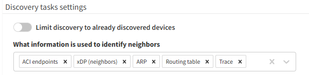

# Discovery Tasks Settings

The **Discovery tasks settings** feature was first introduced in IP Fabric
version `3.5.2` as a fast discovery enablement for large-scale networks.

When the `Limit discovery to already discovered devices` option is enabled, IP
Fabric will only use the current `Discovery History` database (in **Management
--> Discovery History**) when creating a new snapshot, **without detecting any
new network devices**.

If this limit is disabled, the discovery process will crawl through the whole
network, using the selected methods for new device detection (ARP, ACI Endpoints, CDP/LLDP, NDPv6,
Routing Table records, or a Traceroute). The default is to use all available
options.

The feature is especially helpful for large, complex networks with already
defined device scope to avoid multiple repetitive failed SSH/Telnet attempts
that may slow down snapshot creation.

When `Limit discovery to already discovered devices` is enabled, IP Fabric also
ignores all new devices from the discovery seeds and new include lists! If you
need to discover new devices with `Limit discovery to already discovered
devices`, please add them manually to the last (or any other) snapshot.
