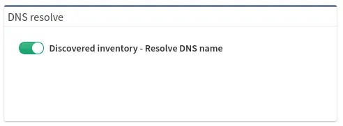
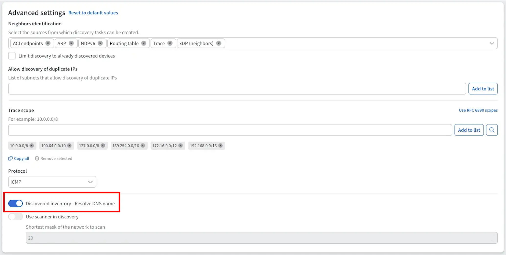

# DNS Resolve

When this option is enabled, IP Fabric performs IP address to DNS name
translation. During the discovery process, this feature sends many requests to
the configured DNS servers.

To enable this option, go to **Settings --> Discovery & Snapshots --> Discovery
Settings --> DNS resolve** and click the **on/off** toggle.

!!! info "New Design"

    Since version 7.10, we are testing a new design of Discovery Settings. In the new design, this setting is located at the bottom of the Discovery tab in the 'Advanced settings' card.

    
