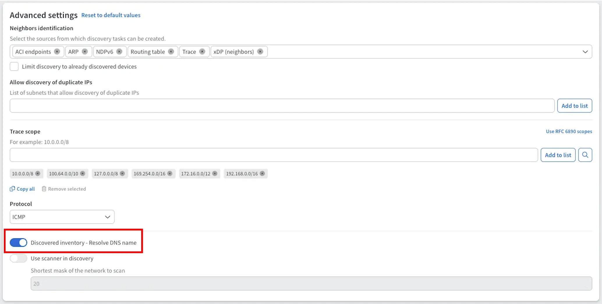

# DNS Resolve

When this option is enabled, IP Fabric performs IP address to DNS name
translation. During the discovery process, this feature sends many requests to
the configured DNS servers.

To enable this option, go to **Settings --> Discovery & Snapshots --> Discovery
Settings --> Discovery** tab. Scroll to the bottom, then toggle **DNS
resolve** in the **Advanced settings** card.

