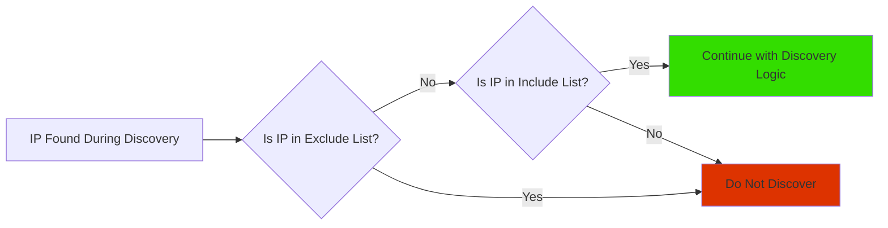

# IP Scope

## Including And Excluding Networks From Discovery

By default, there are no limitations on discovery and all IP addresses
are allowed (i.e. _Include scope_ is `0.0.0.0/0`).

The Include and Exclude lists act as an Access Control List for IP Fabric, when
an IP Address is found during discovery it is then checked against this ACL.

Discovery can be limited to one or more subnets using **Settings --> Discovery
& Snapshots --> Discovery Settings --> Discovery --> IP Scope --> IP networks to
include in discovery and analysis**. Enter one or more subnets to limit the
discovery process to addresses from particular networks.

Specific parts of the network can be also excluded from discovery using
**Settings --> Discovery & Snapshots --> Discovery Settings --> Discovery --> IP
Scope --> IP networks to exclude from discovery and analysis**.

!!! warning "Priority"

    Exclude option takes precedence over include.

!!! note "API Discovery"

    IP Scope settings are not applied to Vendors discovered using API
    (everything is downloaded and used in discovery).

**_Example_**:

_IP networks to include in discovery and analysis:_ `10.0.0.0/8`

_IP networks to exclude from discovery and analysis:_ `10.24.0.0/16`

_Result:_ Only network `10.0.0.0/8` is scanned excluding `10.24.0.0/16`
subnet.
