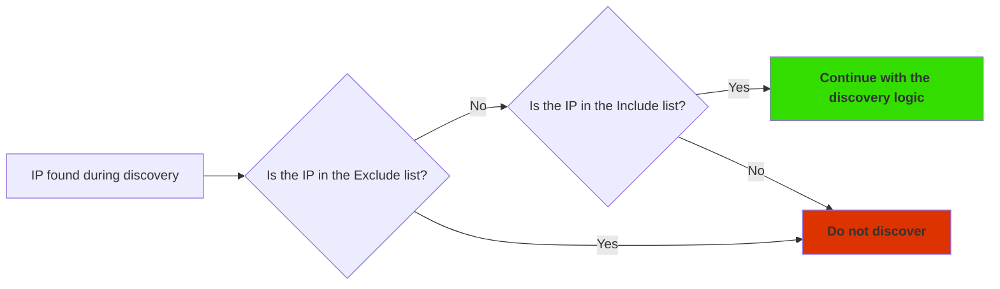
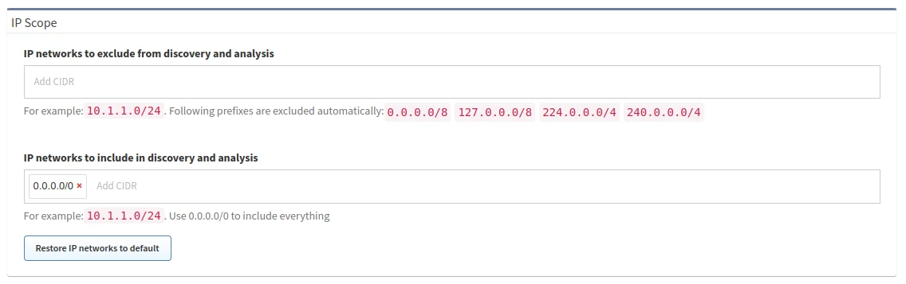

# IP Scope

## Including and Excluding Networks From Discovery

By default, there are no limitations on discovery, and all IP addresses are
allowed (i.e., the _Include scope_ is `0.0.0.0/0`).

The Include and Exclude lists act as an Access Control List for IP Fabric; when
an IP address is found during discovery, it is then checked against this ACL.

Discovery can be limited to one or more subnets using the Include list (in
**Settings --> Discovery & Snapshots --> Discovery Settings --> Discovery -->
IP Scope --> IP networks to include in discovery and analysis**). Enter one or
more subnets to limit the discovery process to addresses from particular
networks.

Specific parts of the network can also be excluded from discovery using the
Exclude list (in **Settings --> Discovery & Snapshots --> Discovery Settings
--> Discovery --> IP Scope --> IP networks to exclude from discovery and
analysis**).

!!! warning "Priority"

    The Exclude list takes precedence over the Include list.

!!! note "API Discovery"

    The IP Scope settings are not applied to vendors discovered using the Vendor
    APIs (everything is downloaded and used in discovery).

**_Example_**:

- _IP networks to include in discovery and analysis:_ `10.0.0.0/8`

- _IP networks to exclude from discovery and analysis:_ `10.24.0.0/16`

- _Result:_ Only the network `10.0.0.0/8` is scanned, excluding the
  `10.24.0.0/16` subnet.
