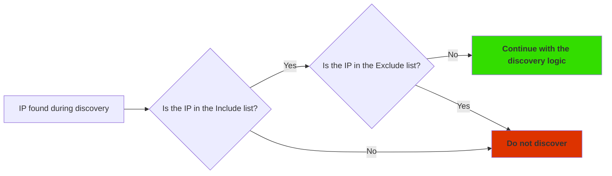
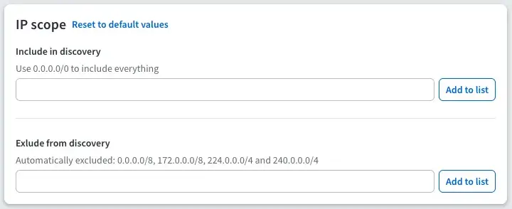

# IP Scope

## Including and Excluding Networks From Discovery

By default, there are no limitations on discovery, and all IP addresses are
allowed (i.e., the _Include scope_ is `0.0.0.0/0` and `::/0`).

The Include and Exclude lists act as an Access Control List for IP Fabric; when
an IP address is found during discovery, it is then checked against this ACL.

```mermaid
graph LR
    ip[IP found during discovery] --> include{Is the IP in the Include list?}

    include -->|Yes| exclude{Is the IP in the Exclude list?}
      exclude --> |No| continue[<strong>Continue with the discovery logic</strong>]
      exclude --> |Yes| doNotDiscover[<strong>Do not discover</strong>]
    include -->|No| doNotDiscover[<strong>Do not discover</strong>]

    style continue fill:#33dd00
    style doNotDiscover fill:#dd3300
```

Both lists are in the **Discovery** tab, in the **Advanced Settings** card under **Settings --> Discovery & Snapshots --> Discovery Settings**.

Use the **Include in discovery** field to limit discovery to one or more subnets. Enter one or more subnets to restrict discovery to addresses from specific networks.

Use the **Exclude from discovery** field to exclude specific parts of the network from discovery.

!!! warning "Priority"

    The Exclude list takes precedence over the Include list.

!!! note "API Discovery"

    The IP Scope settings are not applied to vendors discovered using the Vendor
    APIs (everything is downloaded and used in discovery).

**_Example_**:

- _IP networks to include in discovery and analysis:_ `10.0.0.0/8`

- _IP networks to exclude from discovery and analysis:_ `10.24.0.0/16`

- _Result:_ Only the network `10.0.0.0/8` is scanned, excluding the
  `10.24.0.0/16` subnet.
