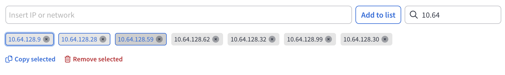

# IPv4 and IPv6 address list

The **IPv4 and IPv6** address list is an interactive input and list management component tailored for handling sets of IP addresses.
It is designed for users who require precise and responsive tools to search, filter, and manage both IPv4 and IPv6 addresses.

It supports precise filtering by IP and CIDR ranges, including compressed IPv6 and embedded formats, while making bulk list management simple and efficient.

## How IPv4 and IPv6 address list filtering works

The system fully supports **IPv4** and **IPv6**, including:

- Exact matches
- CIDR range containment
- Compressed IPv6 addresses
- IPv4-embedded IPv6 addresses

### IPv4 Filtering

- **If the query is a valid CIDR (e.g., `123.123.0.0/16`):**
  - Matches the exact CIDR.
  - Matches all parent CIDRs that include the queried CIDR.

- **If the query is a valid IP address (e.g., `123.123.123.12`):**
  - Matches the exact IP address.
  - Matches `/32` entries.
  - Matches all CIDRs containing this IP address.

- **If the query is neither a valid IP address nor CIDR:**
  - Performs a substring search.
  - Example: searching for `123.13` will find any address containing this substring.

### IPv6 Filtering

- **If the query is a valid CIDR (e.g., `2001:db8::/32`):**
  - Matches the exact CIDR.
  - Matches all parent CIDRs that include the queried CIDR.

- **If the query is a valid IPv6 address (e.g., `2001:db8::1`):**
  - Matches the exact address.
  - Matches `/128` entries.
  - Matches all CIDRs containing this address.

- **Compressed and expanded forms are treated equally:**
  - Forms such as `::`, `0:0:0:0:0:0:0:0`, and `0000:0000:0000:0000:0000:0000:0000:0000` are all matched correctly.

- **IPv4-embedded IPv6 addresses are supported:**
  - Addresses like `::FFFF:192.168.1.1` and their hexadecimal equivalents are recognized as equivalent.

- **If the query is neither a valid IPv6 address nor a CIDR:**
  - Performs a substring search.

## Practical Behavior Summary

| Query Type                   | Match Type                                                                 |
|-----------------------------|-----------------------------------------------------------------------------|
| Valid CIDR                  | Exact match; matches all broader (parent) CIDRs                            |
| Valid IP address            | Exact match; matches `/32` or `/128` entries; matches all broader CIDRs    |
| Invalid IP/CIDR             | Substring search                                                           |
| IPv4-embedded IPv6 addresses| Exact match; recognizes both IPv4-mapped and hexadecimal compressed formats |

## IP List Management

The IP list allows users to efficiently manage IP addresses through enhanced multi-selection capabilities:

- **Shift + Left Click**: Select a range of IP addresses between the first and second click.
- **Click-and-Drag**: Hold the left mouse button and drag across the IP list, similar to text selection in a document, to select multiple addresses easily.

