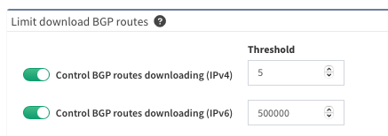

# Limit Download of BGP Routes

The full routing table, including full BGP, may contain more than 900K records
in 2023.

Downloading and processing such a large amount of data is time-consuming and may
not provide any relevant information about the internal IP addressing scheme.

You can find the threshold configuration in **Settings --> Discovery Settings
--> Discovery --> Limit download BGP routes**.

If the number of BGP routes in the routing table is below the specified
threshold, IP Fabric will collect all routes from this table.

However, if the number exceeds this threshold, IP Fabric will only collect
routes from other available routing protocols on the device. In this scenario,
no BGP routes from the routing table will be collected.

Currently supported vendors:

- IPv4
  - Arista (EOS)
  - Cisco (NX-OS, IOS, IOS-XE, IOS-XR, Viptela)
  - Dell (OS10)
  - FS (FSOS)
  - HPE (ArubaCX)
  - Huawei (VRP)
  - Juniper (JunOS)
  - Nokia (TiMOS)

- IPv6
  - Arista (EOS)
  - Cisco (ACI, IOS, IOS-XE, IOS-XR, NX-OS)
  - Juniper (JunOS)
  - Nokia (TiMOS)

Another option to limit the number of BGP routes downloaded is to configure [BGP community filtering](../routing.md).
