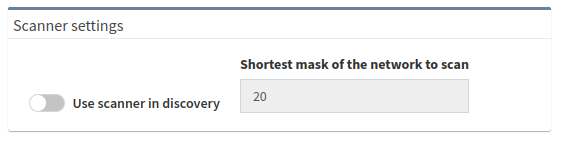

# Scanner Settings

The Scanner intelligently scans the parts of the network that are not reachable
using standard methods by testing the login (SSH/Telnet) to each IP address from
IP networks without any discovered device.

In other words, the Scanner takes each unique route for which the next hop device was 
not discovered. The Scanner excludes a network from scanning if we have already discovered
a device with such a network configured on its L3 interface. Scanning itself attempts
to log in to every IP address within a provided subnet. If Scanner successfully connects
to an IP address, it schedules it for a regular discovery and proceeds with scanning.

For example, if after standard intelligent discovery, there is a network
`10.0.0.0/24` in a routing table that is not configured on any interface 
of already discovered devices, the Scanner will attempt to log in to `10.0.0.1`,
then to `10.0.0.2`, then to `10.0.0.3`, and so on, until all of the addresses
in the `10.0.0.0/24` network has been attempted.

Turn on the Scanner to increase the number of discovered devices.

Go to **Settings --> Discovery & Snapshots --> Discovery Settings --> Discovery
--> Scanner settings** and turn on the **Use scanner in discovery** toggle.

**Shortest mask of the network to scan** -- Defines the maximum size of the
networks in a routing table to be scanned. A smaller prefix length means a
larger network and therefore a longer scan time. The minimum prefix length size
is `/16`.
