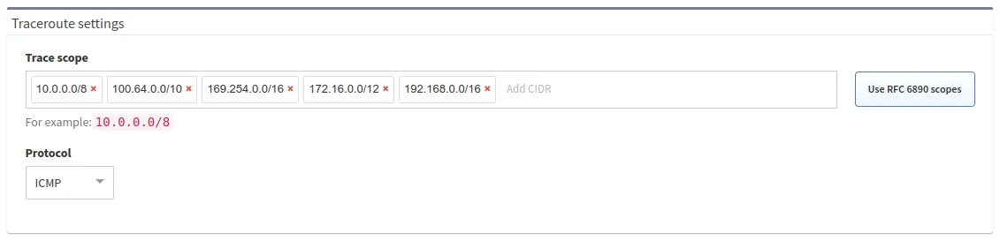
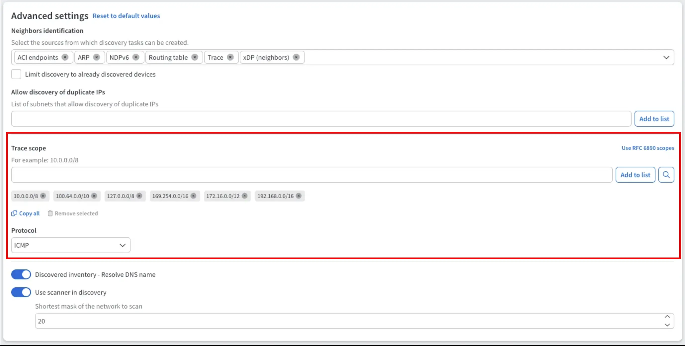

# Traceroute Settings

Traceroute is used when the next hop is not available for SSH/Telnet. Devices
discovered using traceroute are marked as *unmanaged* in IP Fabric site
diagrams. More information about traceroute as a protocol can be found on
[Wikipedia](https://en.wikipedia.org/wiki/Traceroute).

For traceroute configuration, go to **Settings --> Discovery & Snapshots -->
Discovery Settings --> Discovery --> Traceroute settings**.

!!! info "New Design"

    Since version 7.10, we are testing a new design of Discovery Settings. In the new design, this setting is located at the bottom of the Discovery tab in the 'Advanced settings' card.

    

**Trace scope** -- Limits traceroute scope to the defined subnets. This prevents
scanning networks outside an internal network.

**Use RFC 6890 scopes** -- This button resets the **Trace scope** setting to the
subnets defined in this RFC.

**Protocol** -- The protocol used for traceroute. Can be selected from the
options of `ICMP` (MS Windows-like), `UDP` (Linux-like), or `TCP`.

**Port** -- In the case of `UDP` and `TCP`, the destination port can be
specified.
