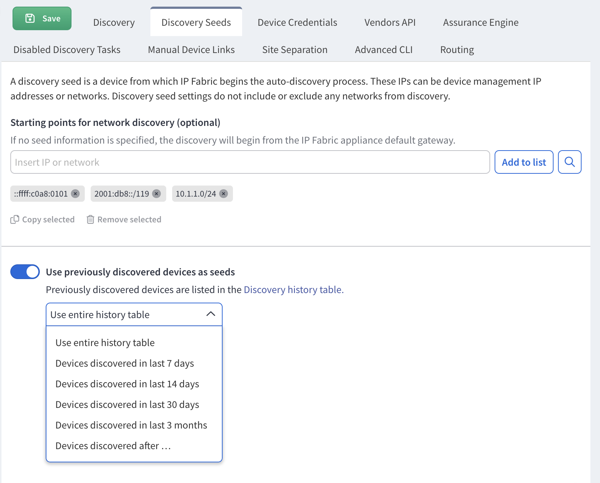

# Discovery Seeds

A discovery seed is a device from which IP Fabric begins the auto-discovery process. These IPs can be device management IP addresses or networks.

If you know a particular starting point for discovering the network, the
information can be entered at **Settings --> Discovery & Snapshots --> Discovery
Settings --> Discovery Seeds**. This option does not exclude any networks from
discovery.

The starting points can be management IP addresses of network devices or
network subnets. Existing inventory data can also be imported.

If no seed information is entered, the discovery will begin from the
current default gateway.

!!! note
    
    It is recommended to provide multiple IP addresses of core routers as a
    starting point for discovery.

!!! warning "Maximum prefix length"

    When you add a network to the discovery seed, IP Fabric attempts to connect
    to all IP addresses in that network. Due to this, the **maximum prefix length**
    you can add into a discovery seed is `/23`.
