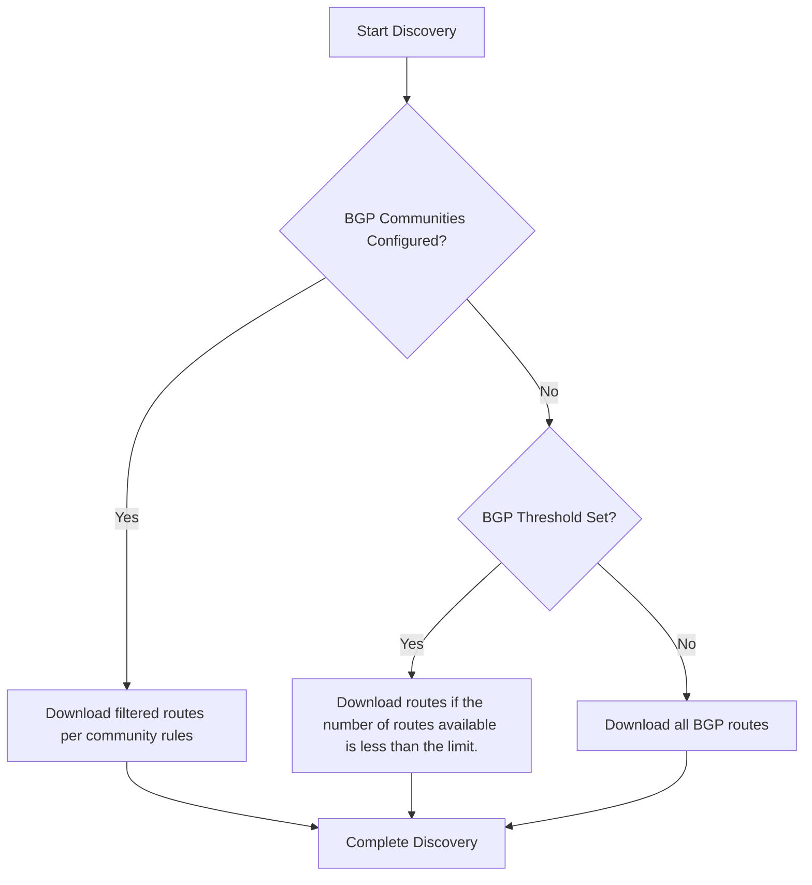

# Routing

## BGP Communities

This feature enables configuration of BGP communities on a **per-device**, **per-protocol** (IPv4/IPv6), and **per-VRF** basis.

### Problem Statement

During network discovery processes, full routing tables containing BGP routes is typically downloaded.
This operation faces two challenges:

1. Extremely large BGP tables can significantly prolong discovery
2. Unnecessary route processing increases resource consumption

### Solution 1: Global BGP Threshold

A global limit for BGP route downloads can be set in **Discovery** settings under [Limit download BGP routes](discovery/limit_download_of_bgp_routes.md).

This solution presents an all-or-nothing approach, lacking flexibility and adaptability.

### Solution 2: BGP Communities (Filter Lists)

BGP communities filters can be set for more precise control:

1. Specify device by serial number
2. Select protocol (IPv4/IPv6)
3. Define VRF
4. List BGP communities (or import them from file)

Routes matching these filters will be downloaded, while others are excluded.

{ width=300 .center }

### Discovery Process Prioritization

#### Key Behaviors

1. **Community Configuration Priority**  
   When present, BGP communities override thresholds. The system:
   - Downloads **all** routes matching community filters (on Cisco IOS-XR router, processing a large number of routes in the community may take some time)
   - Ignores threshold limits
   - Processes all specified VRFs

2. **Threshold Fallback**  
   Without community configuration:
   - Applies global threshold
   - Skips BGP download if route count exceeds threshold

3. **Empty Configuration**  
   Without either setting:
   - Downloads complete BGP table
   - Maximum resource consumption

### Performance Considerations

| Configuration Type       | Speed  | Resource Usage | Precision |
|--------------------------|--------|----------------|-----------|
| No filters/threshold     | Slowest| Highest        | Full data |
| BGP Threshold Only       | Faster | Moderate       | Partial   |
| BGP Community Filters    | Fastest| Lowest         | Targeted  |

