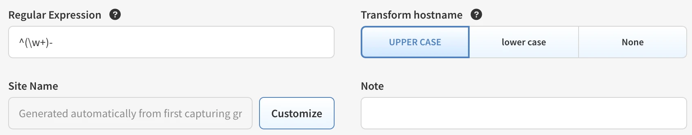
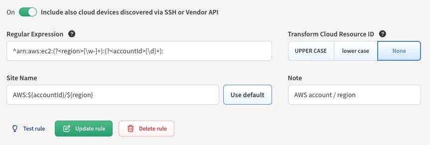
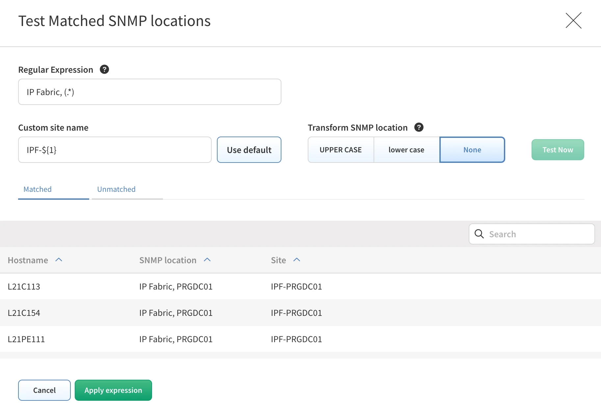
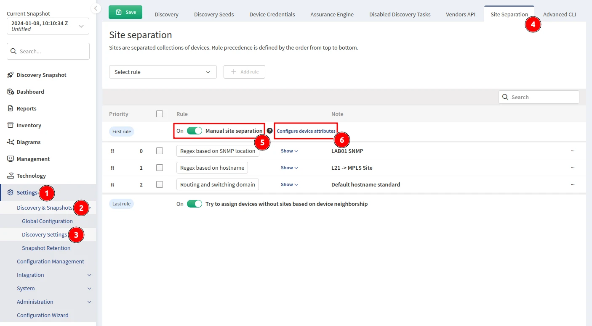
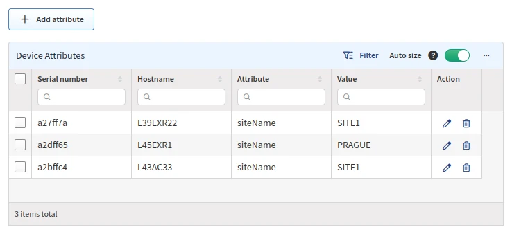

# Site Separation

Sites are separated collections of devices. Rule precedence is defined by the order from top to bottom.

A Site can be a branch, a factory, a production floor, a campus, or anything that represents a Site from a your point of view.

By default, a Site consists of the topology of all contiguously interconnected protocols, and the boundary of a Site is formed by the network protocol relation that is not under management using provided authentication credentials. The default separation is good for MPLS networks, where the directly connected routing infrastructure at a Site's edge is not accessible.

## Regular Expression Site Separation

!!! info

    Site distribution cannot be changed manually when regular expression (regex) rules are used. Sites cannot be renamed.

    Alternatively, site separation can follow a specific regex, where separation will be performed based on a portion of a device hostname, SNMP location or cloud specific properties.

!!! check

    If you cannot cover the names of the Sites with one regex, you can use a logical **or**. Use the `|` (pipe) operator between regex rules or use the Device Attributes method detailed below.

### Hostname Regex

Go to **Settings --> Discovery & Snapshots --> Discovery Settings --> Site Separation**, select
**Regex based on hostname**, and click **+ Add rule** to create a new rule.

**Regular Expression** input value is what the hostnames of discovered devices will be tested against.

You can use capturing groups (sections of regular expression in `(` and `)` brackets), which you can
then refer to in **Site Name** input value. The capturing groups might be named, using the `(?<name>...)` syntax.

**Transform hostname** operation is applied BEFORE the regular expression is applied:

- **UPPER CASE** -- First hostname `PRAGUE-RTR1`, second hostname `prague-rtr2` --> regular expression is applied on `PRAGUE-RTR1` and `PRAGUE-RTR2` hostname strings.
- **lower case** -- First hostname `PRAGUE-RTR1`, second hostname `prague-rtr2` --> regular expression is applied on `prague-rtr1` and `prague-rtr2` hostname strings.
- **None** (default) -- First hostname `PRAGUE-RTR1`, second hostname `prague-rtr2` --> regular expression is applied on the original hostname strings, i.e. `PRAGUE-RTR1` and `prague-rtr2` respectively.

**Site Name** input value is the site to which device will be assigned to in case the name
of the device is matching the Regular Expression.

Site Name might be a string value, e.g. `prague`, or it might be a template string with `${...}`
references to Regular Expression capturing groups, e.g. `production-${1}` or `staging-${city}`.

If at least one capturing group is detected in the Regular Expression, the Site Name input is
disabled and **Customize** button appears.

Unless you click the button, the value matched in the first capturing group of the Regular
Expression is used as the Site Name.

!!! Example "Regex Based on Hostname Using Default Option"

    

    The regular expression matches hostnames such as `Prague-123`, `London-456`, the
    resulting Site Names would be `PRAGUE` and `LONDON` respectively.

If you decide to edit the Site Name, click the **Customize** button and enter Site Name string.

Use numbered references: `${1}` for the value of the first capturing group, `${2}` for second,
..., or named references, e.g. `${city}`, to refer to named capturing groups of Regular Expression.

You can combine both approaches and construct the site names according to your needs, e.g.
`${city}-${street}-${3}`. The compatibility between the Regular Expression and the references
used in the Site Name is checked in UI to prevent any typos or other mistakes.

!!! Example "Regex Based on Hostname Using Customized Site Name"

    

    The regular expression matches hostnames such as `Prague-Parizska-4`,
    `London-Downing_street-10`, the resulting Site Names would be `parizska-of-prague` and
    `downing_street-of-london` respectively.

### SNMP Location Regex

Go to **Settings --> Discovery & Snapshots --> Discovery Settings --> Site Separation**, select **Regex based on SNMP location**, and click **+ Add rule** to create a new rule.


### Cloud Resource ID

Go to **Settings --> Discovery & Snapshots --> Discovery Settings --> Site Separation**, select **Cloud Resource ID (Cloud network)**, and click **+Add rule** to create a new rule.

This rule uses cloud resource ID (**AWS** ARN, **Azure** resource ID, **GCP** full resource name) to build the site name.

The switch **Include also cloud devices discovered via SSH or Vendor API** puts network devices into the same site as the relevant cloud resources. E.g. a router or a firewall running as an AWS instance will be placed to the same site as the VPC where it is deployed (instead of being classified by hostname, SNMP or other site separation rules). If this setting is enabled, ensure that site separation rules are placed in the right order (cloud rules should be above on-prem rules in order to work properly).

**Regular Expression** input value can be found in the table **Technology** --> **Cloud** --> **Nodes** --> **Inventory**, column **Resource Name / ID**.

!!! Example "Cloud Resource ID Site Sepatation"

    
    This example shows use of named regular expression groups. The result site name would be e.g. `AWS:1234567890/eu-north-1`.


### Slug

Go to **Settings --> Discovery & Snapshots --> Discovery Settings --> Site Separation**, select **Slug (Cloud network)**, and click **+Add rule** to create a new rule.

Currently you can select AWS, Azure and GCP devices to be matched by this rule. Whole slug string is used as a site name. It can be transformed to upper case, lower case or kept as it is set in a specific vendor API configuration in **Settings** --> **Discovery & Snapshots** --> **Discovery Settings** --> **Vendors API**.

The switch **Include also cloud devices discovered via SSH or Vendor API** functionality is the same as in [Cloud Resource ID](#cloud-resource-id) site separation rule.


### Testing

The UI allows you to edit and test your rules directly in the browser by selecting the **Test rule** option. Here, you can see a live preview of devices that will match the regex you created.


You can also test SNMP location rules:



!!! example "Regex Example"

    We have several locations whose names are logically designed as one letter with one to three numbers.
    From the point of view of a regex, such a Site can generally be expressed as `^([a-zA-Z]\d{1,3})`.

    Unfortunately, we have two other Sites that do not fit into this schema. These Sites can be defined
    with their own regex, and these can be added to the original one using the logical operator **or**.

    The following example will match one of three options:

    ```
    ^([a-zA-Z]\d{1,3}\|HWLAB\|static\d{1})
    ```

!!! example "Regex Example -- Lookahead"

    You can match a part of the string, only if it contains, or does not contain, a specific expression
    afterward, by using lookahead (positive or negative).

    In the example below, we want to match the first two letters and one number only if we don't
    see the pattern `-dev` afterward. Using this regex:

    ```
    (^[a-zA-Z]{2}[0-9])(?!.*-dev)
    ```

    - `BL1-router01` -- the regex will match.
    - `PA2-router02-dev` -- the regex will not match, as we can see `-dev` in the hostname.

Read more about regular expression and assertion at <https://developer.mozilla.org/en-US/docs/Web/JavaScript/Guide/Regular_Expressions/Assertions#other_assertions>.

## Device Neighborship


For devices not matching prior rules (e.g., non-standard configurations, DMZ devices, or Day 0 unconfigured systems), the site name is inherited from **CDP/LLDP-connected peers**, **STP topology neighbors**, or devices in the same **L3 network**, in order of priority. If linked to a rule-matched device, IP Fabric intelligently groups the device to the correct site, ensuring accurate placement.

## Manual Site Separation (Device Attributes)

**Manual site separation** enables the **Device Attributes** feature to create manual separation if a device does not follow a standard hostname rule or if the hostname is duplicated in multiple locations.

To configure **Device Attributes**, first enable the **Manual site separation** toggle in **Settings --> Discovery & Snapshots --> Discovery Settings --> Site Separation**, and then select **Configure device attributes**:



or go to **Settings --> Discovery & Snapshots --> Global Configuration --> Device Attributes**:


### Device Attributes



- `Serial number` is IP Fabric's "Unique Serial Number" (API column `sn`). This is not the `Serial Number` column, which represents the Hardware SN (API column `snHw`). Devices discovered via API can also be assigned using Device Attributes.
- `Hostname` is populated by IP Fabric when a device matching the `Serial number` is found.
- `Attribute` is the Device Attribute to assign. Since we want to set the Site based on the serial number, set it to `siteName`.
- `Value` is the attribute's value to assign. In this case, we want to split the Site `L35` into separate Sites `35COLO`, `35PRODUCTION`, and `35HEADOFFICE`.

### Creating Rules in the UI

You can create rules in the UI by clicking **+ Add attribute**. This will provide you with a form to fill out.


### Creating Rules via the API

The API is the preferred method of creating rules as it allows for bulk importing. Use the `PUT` method on the endpoint `https://<IPF_URL>/api/<IPF_API_VERSION>/attributes/global`. Below is an example of the payload:

!!! example

    ```json
    {
        "attributes": [
            {"sn": "<DEVICE SERIAL NUMBER01>", "value": "<SITE NAME>", "name": "siteName"},
            {"sn": "<DEVICE SERIAL NUMBER02>", "value": "<SITE NAME>", "name": "siteName"}
        ]
    }
    ```

!!! info

    It's important to specifically use the `siteName` attribute to define the Sites in IP Fabric. You can define other attributes as well, but site separation is solely based on `siteName`.

## Rule Priority


Rule precedence is defined by the order from top to bottom. So, in the example above:

1. **Manual site separation** (if enabled) will look at the **Device Attributes** and try to first assign a device based on its serial number if a match is found.

2. Rules you define. In the example above, it will check the following:

   1. If SNMP Location matches `IPFABRIC, (LAB01)` --> Site `LAB01`.
   2. If Hostname matches `^L21` --> Site `MPLS`.
   3. If Hostname matches `^(L\d{1,2})` --> Site `L2-99`.

3. **Try to assign devices without sites based on device neighborship** (if enabled).

### Reporting Rule Matches With `python-ipfabric` Package

Please see the example on GitLab: <https://gitlab.com/ip-fabric/integrations/python-ipfabric/-/blob/develop/examples/tools/site_separation_report.py>.
