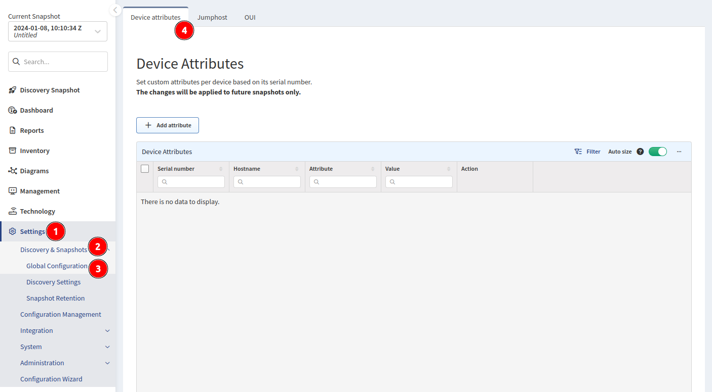
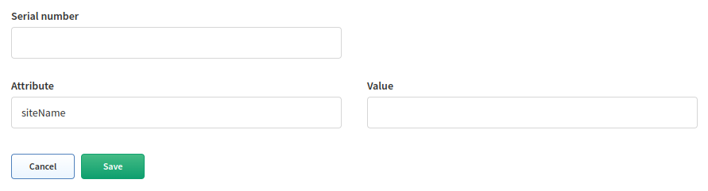

# Site Separation

Sites are separated collections of devices. Rule precedence is defined by the order from top to bottom.

A Site can be a branch, a factory, a production floor, a campus, or anything that represents a Site from a your point of view.

By default, a Site consists of the topology of all contiguously interconnected protocols, and the boundary of a Site is formed by the network protocol relation that is not under management using provided authentication credentials. The default separation is good for MPLS networks, where the directly connected routing infrastructure at a Site's edge is not accessible.

## Regular Expression Site Separation

!!! info

    Site distribution cannot be changed manually when regular expression (regex) rules are used. Sites cannot be renamed.

    Alternatively, site separation can follow a specific regex, where separation will be performed based on a portion of a device hostname or SNMP location.

!!! check

    If you cannot cover the names of the Sites with one regex, you can use a logical **or**. Use the `|` (pipe) operator between regex rules or use the Device Attributes method detailed below.

### Hostname Regex

Go to **Settings --> Discovery & Snapshots --> Discovery Settings --> Site Separation**, select **Regex based on hostname**, and click **+ Add rule** to create a new rule.

**Transform hostname** is used to normalize Site names based on hostname:

- **UPPER CASE** -- First hostname `PRAGUE-RTR1`, second hostname `prague-rtr2` --> result: both devices are in one Site named `PRAGUE`.
- **lower case** -- First hostname `PRAGUE-RTR1`, second hostname `prague-rtr2` --> result: both devices are in one Site named `prague`.
- **None** (default) -- First hostname `PRAGUE-RTR1`, second hostname `prague-rtr2` --> result: each device is in its own Site (`PRAGUE-RTR1` being in `PRAGUE` and `prague-rtr2` being in `prague`).


In this example, the regular expression matches items such as `PRAGUE-`, `LONDON-`, etc.

### SNMP Location Regex

Go to **Settings --> Discovery & Snapshots --> Discovery Settings --> Site Separation**, select **Regex based on SNMP location**, and click **+ Add rule** to create a new rule.


### Testing

The UI allows you to edit and test your rules directly in the browser by selecting the **Test rule** option. Here, you can see a live preview of devices that will match the regex you created.


You can also test SNMP location rules:


!!! example "Regex Example"

    We have several locations whose names are logically designed as one letter with one to three numbers. From the point of view of a regex, such a Site can generally be expressed as `^([a-zA-Z]\\d{1,3})`. Unfortunately, we have two other Sites that do not fit into this schema. These Sites can be defined with their own regex, and these can be added to the original one using the logical operator **or**. The following example will match one of three options:

    ```
    ^([a-zA-Z]\\d{1,3}\|HWLAB\|static\\d{1})
    ```

!!! example "Regex Example -- Lookahead"

    You can match a part of the string, only if it contains, or does not contain, a specific expression afterward, by using lookahead (positive or negative). In the example below, we want to match the first two letters and one number only if we don't see the pattern `-dev` afterward. Using this regex:

    ```
    (^[a-zA-Z]{2}[0-9])(?!.*-dev)
    ```

    - `BL1-router01` -- The regex will match, and the device will be assigned to the Site `BL1`.
    - `PA2-router02-dev` -- The regex will not match, as we can see `-dev` in the hostname.

Read more about regular expression and assertion at <https://developer.mozilla.org/en-US/docs/Web/JavaScript/Guide/Regular_Expressions/Assertions#other_assertions>.

The brief explanation:

- `(^[a-zA-Z]{2}[a-zA-Z0-9])` -- We are going to match those first three characters: `AP1`, or `LO2`...
- `(?![a-fA-F0-9]{3}[.][a-fA-F0-9]{4}[.][a-fA-F0-9]{4})` -- ... only if it is NOT followed by what would be a MAC address.

## Device Neighborship


This option will try to define a device based on its neighbor relationship if a device does not match any previous rule. Perhaps you have devices in your environment that do not follow the normal standard, such as those in a DMZ zone or Day 0 devices that have not been fully configured. If that device is connected to a device that did match a rule, IP Fabric will intelligently group it to the correct Site.

## Manual Site Separation (Device Attributes)

**Manual site separation** enables the **Device Attributes** feature to create manual separation if a device does not follow a standard hostname rule or if the hostname is duplicated in multiple locations.

To configure **Device Attributes**, first enable the **Manual site separation** toggle in **Settings --> Discovery & Snapshots --> Discovery Settings --> Site Separation**, and then select **Configure device attributes**:


or go to **Settings --> Discovery & Snapshots --> Global Configuration --> Device Attributes**:



### Device Attributes


- `Serial number` is IP Fabric's "Unique Serial Number" (API column `sn`). This is not the `Serial Number` column, which represents the Hardware SN (API column `snHw`). Devices discovered via API can also be assigned using Device Attributes.
- `Hostname` is populated by IP Fabric when a device matching the `Serial number` is found.
- `Attribute` is the Device Attribute to assign. Since we want to set the Site based on the serial number, set it to `siteName`.
- `Value` is the attribute's value to assign. In this case, we want to split the Site `L35` into separate Sites `35COLO`, `35PRODUCTION`, and `35HEADOFFICE`.

### Creating Rules in the UI

You can create rules in the UI by clicking **+ Add attribute**. This will provide you with a form to fill out.




### Creating Rules via the API

The API is the preferred method of creating rules as it allows for bulk importing. Use the `PUT` method on the endpoint `https://<IPF_URL>/api/<IPF_API_VERSION>/attributes/global`. Below is an example of the payload:

!!! example

    ```json
    {
        "attributes": [
            {"sn": "<DEVICE SERIAL NUMBER01>", "value": "<SITE NAME>", "name": "siteName"},
            {"sn": "<DEVICE SERIAL NUMBER02>", "value": "<SITE NAME>", "name": "siteName"}
        ]
    }
    ```

!!! info

    It's important to specifically use the `siteName` attribute to define the Sites in IP Fabric. You can define other attributes as well, but site separation is solely based on `siteName`.

## Rule Priority


Rule precedence is defined by the order from top to bottom. So, in the example above:

1. **Manual site separation** (if enabled) will look at the **Device Attributes** and try to first assign a device based on its serial number if a match is found.

2. Rules you define. In the example above, it will check the following:

   1. If SNMP Location matches `IPFABRIC, (LAB01)` --> Site `LAB01`.
   2. If Hostname matches `^L21` --> Site `MPLS`.
   3. If Hostname matches `^(L\d{1,2})` --> Site `L2-99`.

3. **Try to assign devices without sites based on device neighborship** (if enabled).

### Reporting Rule Matches With `python-ipfabric` Package

Please see the example on GitLab: <https://gitlab.com/ip-fabric/integrations/python-ipfabric/-/blob/develop/examples/tools/site_separation_report.py>.
