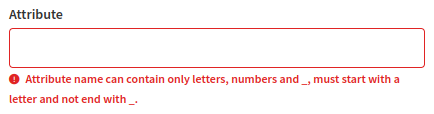
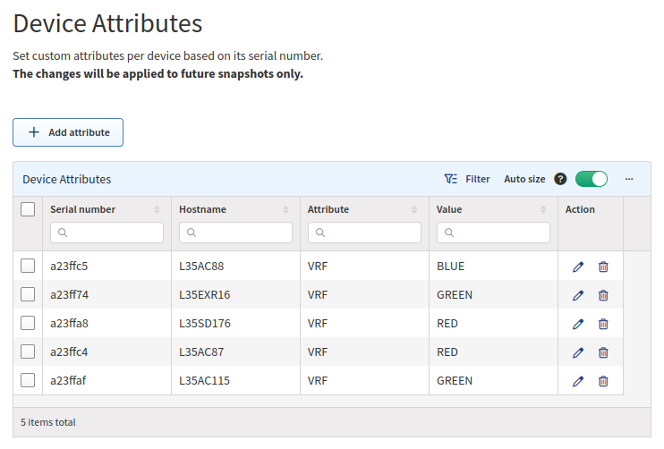

# Device Attributes

Version 4.3 has added the ability to add attributes to a device based on the IP
Fabric Unique Serial Number. In versions earlier than 6.0.0 this only supported
manually changing a Device’s Site Name, Routing Domain, or STP Domain. IP Fabric
now supports adding custom attributes. The attribute name may not contain any
spaces or special characters.

## Attribute Requirements

Attribute names must match the following
regex `^[a-zA-Z][a-zA-Z0-9_]*[a-zA-Z0-9]+$`. Underscore `_` is valid and will
later be used to denote Hierarchical Attributes (i.e. REGION_COUNTRY).

## Global Attributes

Attributes can be assigned globally or locally to an individual snapshot. To
assign global attributes, navigate to **Settings --> Discovery & Snapshots -->
Global Configuration --> Device Attributes**. Once an attribute is assigned a
new snapshot is required for it to be applied.

- **Serial Number** is IP Fabric’s **Unique Serial Number** (API column
  `sn`); this is not the column **Serial Number** which represents the Hardware
  SN (API column `snHw`)

  - Devices discovered via API can also be assigned using Device Attributes.

- **Hostname** is populated by IP Fabric when a device matching the
  **Serial Number** is found

- **Attribute** is the Device Attribute to assign.

- **Value** is the attribute’s value to assign.

### Creating rules in the UI

To create rules in the UI, click **+ Add attribute**. A form will be shown to be
filled out: 

The dropdown is intuitive and will let you search based on SN or hostname.

!!! Info

    Currently, there is an issue where IP Fabric will not search
    for devices discovered via an API in the UI. Even though it seems that no
    device matches the SN, the attribute will still be assigned to the device.

### Creating rules via the API

This is the preferred method of creating rules as it allows for bulk importing.

| Method | Put                                                                                                         |
| :----- | :---------------------------------------------------------------------------------------------------------- |
| URL    | `https://<IPF_URL>/api/v6.0/attributes/global`                                                              |
| Data   | `{"attributes": [{"sn": "<IPF SERIAL NUMBER>", "value": "<ATTRIBUTE NAME>", "name": "<ATTRIBUTE VALUE>"}]}` |

### Creating Global Attributes in Python

Please see the examples at
[`examples/settings/attributes_mgmt_ip.py`](https://gitlab.com/ip-fabric/integrations/python-ipfabric/-/blob/develop/examples/settings/attributes_mgmt_ip.py)
and
[`examples/settings/attributes_sitename.py`](https://gitlab.com/ip-fabric/integrations/python-ipfabric/-/blob/develop/examples/settings/attributes_sitename.py).

## Local Attributes

Local or 'Snapshot Specific' Attributes are applied during discovery and stored
in the snapshot file separate from the Global Settings. Currently, you are able
to:

- Update from Global Settings
  - Update `Settings > Discovery & Snapshots > Global Configuration > Device Attributes`
  - Navigate to the Snapshot's `Settings > Device Attributes` under `Discovery Snapshot`
  - Select `Update from global settings`
- Use the API (or Python SDK) to view, add, edit the snapshot local attributes.

Editing snapshot local attributes will require recalculations if a device `stpDomain`, `siteName`,
or `routingDomain`has been changed.

### Creating Local Attributes in Python

Please see the example at
[`examples/settings/local_attributes.py`](https://gitlab.com/ip-fabric/integrations/python-ipfabric/-/blob/develop/examples/settings/local_attributes.py).
