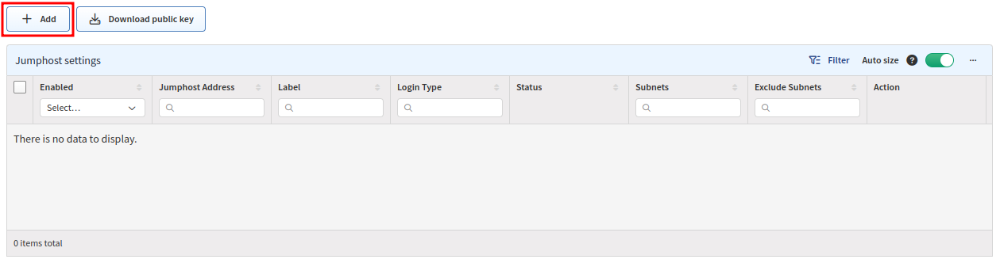
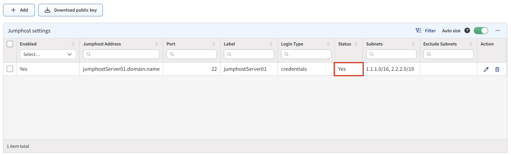
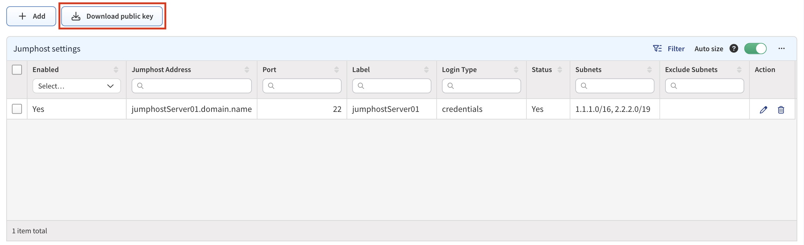
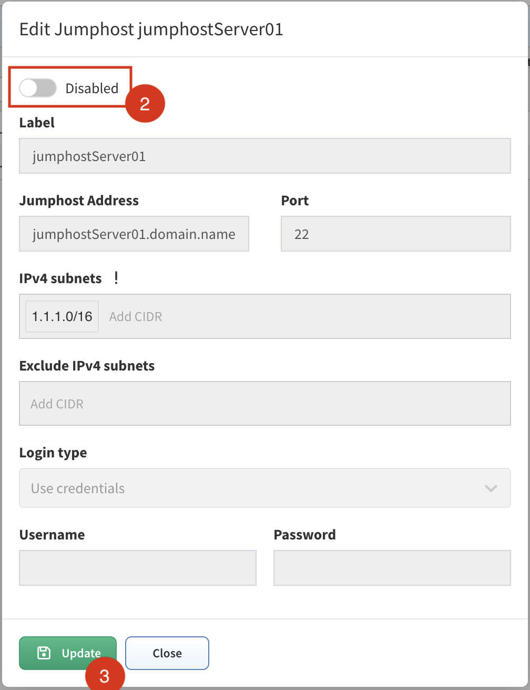
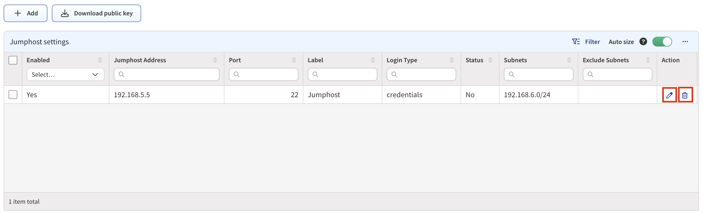
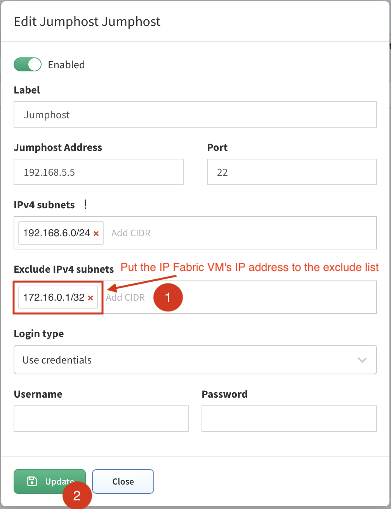

# Jumphost

## Setting Up Jumphost

**Jumphost** allows to set-up a connection to the server which can be used as a **proxy server for discovery** purposes. IP Fabric uses an SSH tunnel established by python on the client and the server side.

The user used for **Jumphost** connection must have access to jumphosts `shell` and must be able to run `python`.

We successfully tested IP Fabric against jumphosts with the following python versions:

| Jumphost Python Version |               |
|-------------------------|---------------|
| 2.7                     | tested        |
| 3.4                     | tested        |
| 3.5                     | tested        |
| 3.6                     | **supported** |
| 3.7                     | **supported** |
| 3.8                     | **supported** |
| 3.9                     | **supported** |
| 3.10                    | tested        |

!!! Note "Tested vs. Supported"

    `tested` -- Python version was successfully tested on a jumphost however it is not officially supported by the underlying SSH tunnel project.

    `supported` -- Python version was successfully tested on a jumphost and it is officially supported by the underlying SSH tunnel project.
    **We strongly recommend using the supported Python versions in your production environment.**

!!! warning

    Please bear in mind, that once the connection is established, it will be enabled permanently, until disabled or removed! If there are any network issues, IP Fabric software will try to establish a connection periodically.

!!! important

    In the [Discovery Seeds](../Discovery_Settings/discovery_seeds.md) settings, at least one IP address behind the Jumphost has to be provided as a starting point.

### Adding New Jumphost

- Go to **Settings --> Discovery & Snapshots --> Global Configuration --> Jumphost**.
- On the page, click **+ Add**:

  

- Fill in all necessary data:

  

  - **Label** - the name for configuration (mandatory)
  - **Jumphost Address** - IP address or FQDN name (mandatory)

    !!! tip "Custom Port"
        If you want to use a custom port for the jumphost connection, please use the following format: `IP/FQDN:PORT` 

        
  - **IPv4 subnets** - subnet in CIDR representation, allows adding more than open, separated with spaces (mandatory)

    !!! warning

        If you use `0.0.0.0/0` or another subnet that **includes the IP address of IP Fabric**, please make sure to **add IP Fabric IP address/subnet** to **"Exclude IPv4 subnet"**. Otherwise, the connection to IP Fabric will be lost and you **will not** be able to **access IP Fabric GUI/CLI** and it will require manual intervention to fix.

        Also if you have multiple jumphosts that have IP address that is part of include list of another jumphost, add the IP addresses in all the other jumphosts exclude lists.
            

  - **Exclude IPv4 subnets** - subnet to exclude in CIDR representation, allows to add more than open, separated with spaces (optional)
  - **Login type**
  - **Use credentials** - required to provide username and password
  - **Use SSH keys** - if you copied the SSH public key to the proxy server, it won’t require providing a password (please jump to the _SSH key configuration_ section)
  - **Username** - Username for authentication (mandatory)
  - **Password** - password for authentication (mandatory if ‘Use credentials’ is used) i.e., refer to the picture below.

    --8<-- "snippets/username_password_regex.md"

- Click the green **Add** button to save the configuration.

- If the connection is open, you will see `Yes` in the `Status` column in the `Jumphost settings` table:

  

### SSH Key Configuration

!!! info

    To avoid using a password for authentication, you can add the SSH key to the proxy server.

#### Copy SSH Key Manually

1. Download the SSH key from Jumphost settings:

   

2. Save `jumphost-public-key.pub`.

3. Insert content of the `jumphost-public-key.pub` file to the `authorized_keys` file of the user that will authenticate with Jumphost server. Please follow official documentation at <https://www.ssh.com/academy/ssh/authorized-key>.

   You can also use `ssh-copy-id` on your machine to deploy the key (see below).

4. After the key is transferred to the jumphost server, you can use the `Use SSH keys` option instead of `Use credentials`.

#### Use `ssh-copy-id`

1. Log in to the IP Fabric CLI using the `osadmin` account.

2. Change to user `autoboss` by running `sudo su - autoboss`.

3. Run `ssh-copy-id` with specified identity file replacing `<jumphost-user>` with the
   jumphost user and `<jumphost-ip>` with the IP or FQDN of the jumphost server:

   1. `ssh-copy-id -i ~/.ssh/ipf-jumphost.pub <jumphost-user>@<jumphost-ip>`
   2. When prompted for a password, use the jumphost user's password.

4. To test, connect to the jumphost server via SSH with: `ssh <jumphost-user>@<jumphost-ip>`

5. If the key has been copied you can use the `Use SSH keys` option instead of
   `Use credentials`.

### Disabling Jumphost Connection

1. Edit configuration that needs to be disabled, i.e.:

   

2. Change the setting to `Disabled`.

3. Click **Update**.

   

### Remove Jumphost Configuration

1. In the `Jumphost settings` table, select the server you want to remove.

2. Click **Delete**.

   

3. (If SSH key authentication was enabled) Delete inserted IP Fabric public key from the `authorized_keys` file on the jumphost server added in the [SSH Key Configuration](#ssh-key-configuration).

## Jumphost Known Issues

### Non-TCP Discovery

Only TCP connections work through the jumphost.

Traceroute with ICMP is not supported so the discovery process might not be able to get over the unreachable parts of the network (for example sites separated by the provider’s network).

Because of this, you will have to add at least one IP address of a network device from each site to the [Discovery Seeds](../Discovery_Settings/discovery_seeds.md) settings.

### IP Fabric Is Not Accessible After Saving Jumphost Configuration

If you can't open the main GUI or ssh to the IP Fabric machine, the subnet/IP address of the IP Fabric machine was most likely included in the jumphost configuration.

To fix this issue, you have to have a **direct access** to the **virtual machine CLI** from a hypervisor, the password for `osadmin` user account, and do the following:

1. Log in to the **virtual machine CLI** with the `osadmin` account.

2. Filter out the **jumphost** services with `systemctl | grep jumphost` command. Each configured jumphost has its own ID:

   

3. **Stop the jumphost service** with the command `sudo systemctl stop jumphost@xxxx.service`, confirm the `osadmin` password:

   

4. Check that the **jumphost process is inactive** with `systemctl status jumphost@xxxx.service` command:

   

5. IP Fabric GUI should be accessible by now.

6. Log in to the **IP Fabric main GUI** with your regular account and go to **Settings --> Discovery & Snapshots --> Global Configuration --> Jumphost**.

7. Make a screenshot or copy the settings of the old jumphost and then delete or edit the jumphost settings.

   

8. Put **IP address/subnet of the IP Fabric** machine to the **exclude IPv4 subnets** or **edit** the **IPv4 subnets** so it does **not contain the IP address of IP Fabric**:

   

!!! info

    If **IP Fabric** becomes inaccessible via GUI or SSH again, repeat the previous steps and again edit the jumphost configuration.
