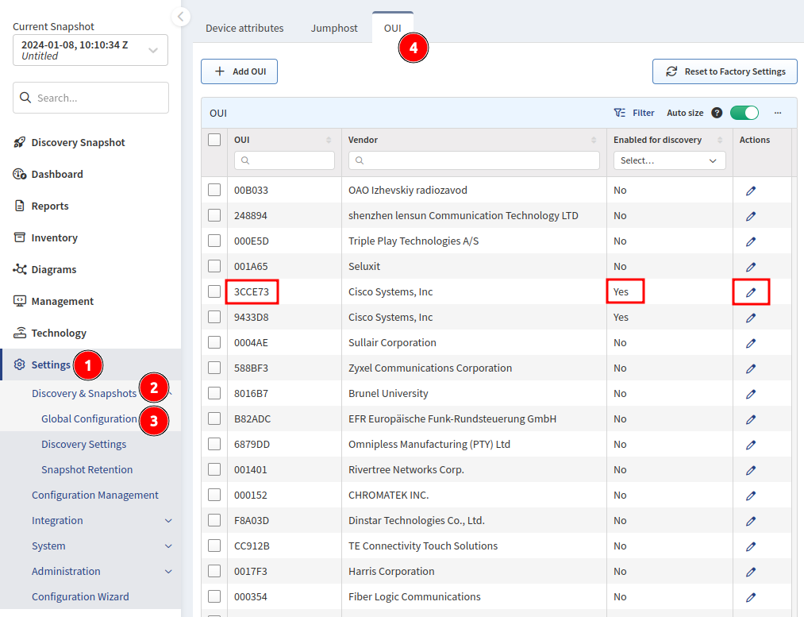

# OUI (Organizationally Unique Identifier)

IP Fabric includes an OUI (Organizationally Unique Identifier) MAC table
of network device manufacturer and uses it during the discovery process
whenever there is a network device discovered through the ARP table.

This table can be found in **Settings --> Discovery & Snapshots --> Global
Configuration --> OUI**.

It contains an OUI (the start of a device's MAC address), the vendor to whom
this OUI belongs and if it is enabled (can be used) during the discovery
process.

Custom OUIs can be added with the **+ Add OUI** button.

All OUIs can be enabled or disabled for discovery through the **Edit** button.

!!! info

    If there are network devices in your infrastructure that were found as
    hosts and IP Fabric did not try to connect to them during the discovery,
    please refer to this table and check if OUIs of those devices are
    enabled for discovery.
