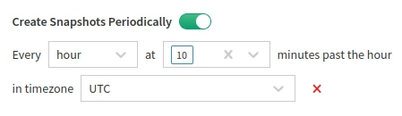
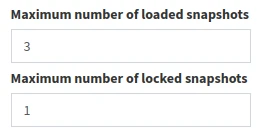

# Snapshot Retention

## Create Snapshots Periodically

For [change management](../../IP_Fabric_GUI/management/changes.md), it is necessary to regularly run IP Fabric discovery. A periodic discovery run can be scheduled
in **Settings --> Discovery & Snapshots --> Snapshot Retention --> Create Snapshots Periodically**.

Here is an example of an automatic discovery run at **10 minutes past
every hour** (0:10, 1:10, 2:10, 3:10, etc.).

### How Scheduling Works in IP Fabric

Let's assume that a snapshot is scheduled for every hour, and it
takes 4 hours and 20 minutes to be created. Then, the next snapshot will be scheduled
once the previous snapshot finishes. The scheduled time will be set at
the next possible period according to the cron setup.

## Maximum Number of Loaded/Locked Snapshots

In **Settings --> Discovery & Snapshots --> Snapshot Retention**, you can change these parameters:

- **Maximum number of loaded snapshots**
  - Maximum number of snapshots that can be loaded in **Discovery Snapshot**.
  - Default value: 3
  - Possible values: 1-5
- **Maximum number of locked snapshots**
  - Maximum number of loaded snapshots that can be locked in **Discovery Snapshot** to prevent them from being unloaded.
  - Default value: 1
  - Possible values: 0-4

## Snapshot Retention Rules

In version `4.1`, we added support for various snapshot retention policies.

### How Snapshot Retention Works

It works in two steps:

1. If any of the **keep** rules are enabled, IP Fabric goes through
   unloaded snapshots and, based on enabled **keep** rules, it marks
   snapshots to be retained or deleted.

2. HDD utilization and the number of unloaded snapshots are checked. If
   any of these rules are exceeded, the oldest unloaded snapshots are
   deleted.

Please note:

1. HDD utilization and the number of snapshots have precedence over
   **keep** rules. This means that snapshots marked as retained by a
   **keep** rule can be deleted when HDD utilization or the number of
   snapshots are exceeded.

2. When at least one retention rule is enabled, all snapshots not
   protected by them will be removed regardless of reaching HDD
   utilization or snapshot count limits.

3. Loaded snapshots are not affected by these rules. It affects only
   unloaded unlocked snapshots.

4. Currently, IP Fabric only supports the delete action. Additional
   actions will be added in upcoming releases.

!!! info

    At the moment, snapshot retention runs every day at 0:00 UTC.
