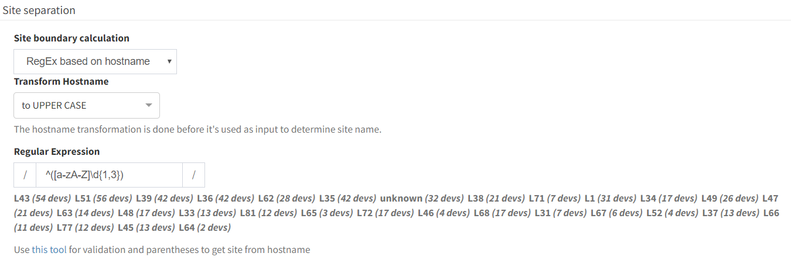

# Site Separation (up to 4.2.x)

## RegEx based on hostname

!!! info
    Site distribution cannot be changed manually when regex rules are used. Sites cannot be renamed.

Alternatively, site separation can follow a specific Regular Expression
(RegEx) where separation will be performed based on portion of a device
hostname.

Go to ***Settings → Site separation*** and change ***Routing & Switching
Domain*** to ***RegEx based on hostname*** or create a new rule by **Add
rule** button.

**Transform hostname** is used to normalize site names based on
hostname:

-   Upper case (default) - first hostname "PRAGUE-RTR1", second hostname
    "prague-rtr2" => result is that both devices in one site named
    "PRAGUE"

-   Lower case - first hostname "PRAGUE-RTR1", second hostname
    "prague-rtr2" => result is that both devices in one site named
    "prague"

-   No transformation - first hostname "PRAGUE-RTR1", second hostname
    "prague-rtr2" =>result is that each device has its own site named
    "PRAGUE" and "prague"

In the last step, introduce the ***Regular Expression***. Use [this
tool](https://regex101.com/) for validation and parentheses to extract
the site from the hostname correctly.

!!! check 
    If you cannot cover the names of the sites with one regex, you can use logical ***or***. Use **\|** (pipe) the character between RegEx rules.

The change in the regex is displayed as a live preview.

Once the regex is ready, click '***Site overview with this RegEx'*** and
observer results. ***Save*** (in the upper right corner).

**RegEx example**:

We have several locations whose name is logically designed as one letter
with one to three numbers. From the point of view of a regex, such a
site can generally be expressed as
"**^([a-zA-Z]\\d{1,3})**". Unfortunately, we have two other sites that
do not fit into this schema. These sites can be defined with their own
regex and this can be added to the original one using the logical
operator ***or***:

***^([a-zA-Z]\\d{1,3}\|HWLAB\|static\\d{1})*** - 1st option OR 2nd
option OR 3rd option  

!!! warning
    For devices that do not match the RegEx, IP Fabric automatically adds those to the site based on protocol relation (CDP, LLDP, STP, L3) under the condition that there's only a single relation to one particular site. This feature is especially useful for Access Points and similar devices, that do not follow the standard naming conventions and are linked to one specific location.

## Manual Site Separation

!!! info
    With this setting, you can manually edit the distribution of sites.

The Manual Site Separation option is complementary to two previous
options and provides the users with full flexibility.

Go to ***Settings → Site separation*** and select **Manual site
separation** from drop down menu and save changes.

In **Inventory → Sites → Manual Separation** any device can be adjusted
based on more attributes and new sites can be created.
