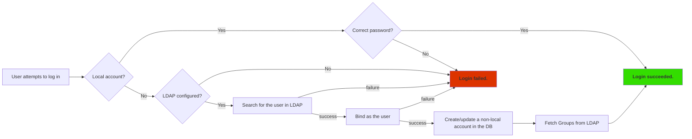

# LDAP

LDAP (Lightweight Directory Access Protocol) authentication is a secure and
reliable method for authenticating users and granting access to network
resources. It is a widely used protocol for authentication and authorization in
enterprise networks and is an important component of any secure network
infrastructure.

We regularly test our LDAP implementation against Microsoft Active Directory and
OpenLDAP.

## Authentication Flow

Local authentication takes precedence over other authentication methods. This
means that LDAP is consulted only if the user doesn't have a local account.
Therefore, we recommend keeping the number of local accounts to an absolute
minimum when an external authentication method (like LDAP) is in use.

IP Fabric authenticates users with LDAP every time they try to log in with a
username and password. Accounts are not synchronized or imported in advance. The
simplified authentication flow for configured and enabled LDAP is as follows:



If a user is successfully authenticated through LDAP, basic information about
this user is then passed from LDAP and stored in the database as a non-local
account. Information about groups and memberships is also fetched and stored
within the database.

Local accounts have the `isLocal` attribute set to `true`. You may see accounts
for external authentication methods also being created, but these will have
`isLocal` set to `false`, and they will not be considered for local
authentication. Records are created for housekeeping reasons, primarily to
maintain a consistent mapping to local groups and roles.

## Enable LDAP Authentication


1. Log in to IP Fabric as a user with admin rights.

2. Navigate to **Settings --> Administration --> LDAP**.

3. Click **+ Add Domain**.

4. In the **Type** drop-down list, select the LDAP server type (`Active
   Directory` or `OpenLDAP`).

5. In the **Suffixes** field, enter all the aliases/suffixes for this
   domain.

   1. Each suffix must begin with `@`.
   2. If the same user can log in with other suffixes (for example,
      `joe@europe.domain.com` and `joe@domain.com`), then fill in
      `@europe.domain.com` and `@domain.com`.

6. Add servers for the domain:

   1. As an **explicit list of addresses**:

      1. In the **Servers** drop-down list, select `Use pre-configured LDAP
         servers`.

      2. Specify the full FQDN (including domain) or IP address of the LDAP
         server, including the protocol prefix. For example,
         `ldap://your.domain.com` or `ldaps://your.domain.com`.

      3. Specify the port. The default ports for LDAP and LDAPS are `389` and
         `636`, respectively.

      4. For LDAPS (LDAP over SSL), also upload the Root CA certificate used for
         the LDAP certificate.

      5. Click **+ Add Server** if you want to add backup servers.

   2. Using **DNS service records**:

      1. In the **Servers** drop-down list, select `Use DNS to find LDAP
         servers`.

      2. Select or upload a certificate (recommended in a production
         environment).

      3. Define the **DNS domain value** (DNS address).

      4. Define the **Service location name** (common names are `ldap` and
         `ldaps`). This is the network service that constructs the final name of
         the record. The construction is done as follows:
         `\_{{service location name}}.\_tcp.{{dns address}}`

7. In the **Bind DN** field, specify a service account with LDAP `read`
   permissions. This field must be an **escaped** LDAP-style **distinguished
   name**.

   Examples:

   1. `CN=Doe\, Joe,OU=europe,DC=your,DC=domain,DC=com`
   2. `CN=User,OU=europe,DC=your,DC=domain,DC=com`

8. In the **Bind credentials** field, enter the bind user's (defined in step 7)
   password.

9. In the **Search base** field, enter a whole domain or specific organization
   unit (container) to specify where users and groups are found in the LDAP
   tree. For example, `OU=NetworkAdmins,DC=your,DC=domain,DC=com`.

10. In the **Search email attribute** field, enter the attribute where the email
    address is stored in the LDAP user object.

11. Only for `Active Directory`:

    For nested group permission lookup, enable **Allow nested groups**. This
    uses the
    [Extensible Match](https://ldapwiki.com/wiki/Wiki.jsp?page=ExtensibleMatch)
    operator
    [`LDAP_MATCHING_RULE_IN_CHAIN`](https://ldapwiki.com/wiki/Wiki.jsp?page=LDAP_MATCHING_RULE_IN_CHAIN),
    which might be slow in your local setup.

12. Click **Confirm**.

!!! note

    If the LDAP server is not reachable or credentials to the service account
    are not correct, LDAP authentication cannot be set.

!!! Info "Two or More LDAP Servers"

    If two or more LDAP server configurations are present, an email suffix
    needs to be added to the username when logging in.

    A username alone works only in a situation when one LDAP server
    configuration is present.

## LDAP Group Permissions


After the LDAP server is added, group permissions can be set.

All authenticated users will get the assigned role configured for `Authenticated
user`:

- By leaving this role empty, it is possible to ensure that users logged in via
  LDAP will get an `API_INSUFFICIENT_RIGHTS` error upon login / access to the API.
- Alternatively, this could be set to a `read-only` role so that any user who
  authenticates successfully to LDAP will have access to IP Fabric.

!!! warning "Primary User Groups Are Not Supported"

    It is recommended to create new
    LDAP groups (such as `IP_FABRIC_ADMINISTRATORS`, `IP_FABRIC_USERS`, etc.) and
    assign them permissions.

## Disable LDAP Authentication

To disable LDAP authentication, delete all LDAP configuration domains in
**Settings --> Administration --> LDAP**.

## Troubleshooting

The two most common issues are either incorrectly configured search account
(**Bind DN**, **Bind credentials**) or an incorrect **Search base**. These will
typically result in an `LDAP Search Failed` error being shown.

Please be aware that due to security concerns, all LDAP errors regarding server
connection and user binding are returned as `LDAP as provided is not reachable`.

Before contacting our Support team, please make sure that the information you
entered in the IP Fabric GUI is correct.

### Using `ldapsearch` To Verify LDAP Configuration

You can use the `ldapsearch` command-line utility to independently query LDAP
servers. `ldapsearch` is present on the IP Fabric appliance (access it via SSH),
or it can be installed locally as part of the `ldap-utils` Linux package. It is
recommended to **always test the LDAP configuration from the IP Fabric
appliance** to rule out connectivity issues.

!!! warning

    The following example doesn't verify the SSL certificate if LDAPS is used.

```bash title="Basic Bind as Search DN"
LDAPTLS_REQCERT=ALLOW ldapsearch \
  -W -H "ldaps://your-ldap-server:636" \
  -D "$LDAP_BIND_DN" \
  -b "$LDAP_SEARCH_BASE" \
  -s sub
```

The exit code of the command above is zero if `ldapsearch` was able to establish
a connection and bind. It will ask for a bind password interactively. An LDAP
search/filter query can be added to the end of the previous example code.

```text title="Search for a Specific User Account"
(uid=$LOGIN_INPUT)
(|(sAMAccountName=$LOGIN_INPUT)(userPrincipalName=$LOGIN_INPUT))
```

```text title="Nested Groups Membership Search"
(member:1.2.840.113556.1.4.1941:=$USER_DN)
```
