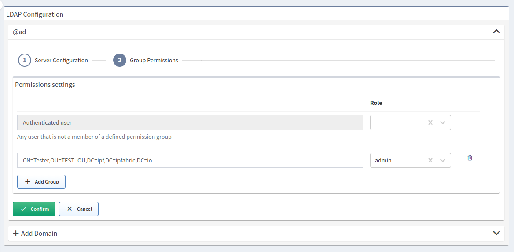

# LDAP

LDAP (Lightweight Directory Access Protocol) authentication is a secure and reliable method of authenticating users and granting access to network resources. It is a widely used protocol for authentication and authorization in enterprise networks and is an important component of any secure network infrastructure.

We regularly test our LDAP implementation against `OpenLDAP` and `Microsoft Active Directory`.

## Authentication Flow

Local authentication has a precedence over other authentication methods. This means that LDAP is consulted only if the user doesn't have a local account. Thus, we recommend keeping the number of local accounts to an absolute minimum in cases when an external authentication method (like an LDAP) is in use.

IP Fabric implementation authenticates users with LDAP every time they try to log in with username and password to IP Fabric. Accounts are not synchronized or imported in advance. Simplified authentication flow for configured and enabled LDAP is as follows:


If a user is successfully authenticated through LDAP, basic information about this user is then passed from LDAP and stored in the database as a non-local account. Also, information about groups and memberships is fetched and stored within the database.

Local accounts have `isLocal` attribute set to `true`. You may see accounts for external authentication methods also being created, but these will have `isLocal` set to `false`, and they will not be considered for local authentication. Records are created for housekeeping reasons, primarily to have a consistent mapping to local groups and roles.

## Enable LDAP Authentication


1. Log in to IP Fabric as a user with admin rights.

2. Go to **Settings --> Administration --> LDAP**.

3. Select **+ Add Domain**.

4. Choose LDAP server type in the **Type** drop-down menu (Microsoft
   Active Directory or Open LDAP).

5. Enter all the aliases/suffixes for this domain in the **Account suffixes**
   field.

   1. Each suffix must begin with `@`.
   2. If the same user can log in with other suffixes, for example,
      `joe@europe.domain.com` and `joe@domain.com`
      then fill in `@europe.domain.com` and `@domain.com`.

6. Add servers for the domain:

   1. As an **explicit list of addresses**:

      1. Choose **Use pre-configured LDAP servers** in Servers' dropdown.

      2. Specify full FQDN (including domain) or IP address of the LDAP server
         including the protocol prefix (such as `ldap://your.domain.com`
         or `ldaps://your.domain.com`).

      3. Specify the port (default ports are 389 for LDAP and 636 for LDAPS).

      4. For LDAP over SSL, also upload a Root CA certificate used for the LDAP
         certificate signature.

      5. Click **+ Add Server** if you want to add backup servers.

   2. Using **DNS service records**:

      1. Choose **Use DNS to find LDAP servers** in Servers' dropdown.

      2. Choose or upload a certificate (recommended in the production
         environment).

      3. Define the DNS address.

      4. Define Service location name (common names are `ldap` and `ldaps`).
         This is the network service that constructs the final name of the
         record. The construction is done as follows:
         `\_{{service location name}}.\_tcp.{{dns address}}`

7. Specify service account with LDAP read permissions in the **Bind DN** field.
   This field must be an **escaped** LDAP-style **distinguished name**.
   Examples:

   1. `CN=Doe\, Joe,OU=europe,DC=your,DC=domain,DC=com`
   2. `CN=User,OU=europe,DC=your,DC=domain,DC=com`

8. Enter the bind user's password (defined in step 7) in the
   **Bind credentials** field.

9. Enter a whole domain or specific organization unit (container) in
   **Search base** to specify where users and groups are found in the LDAP tree,
   for example: `OU=NetworkAdmins,DC=your,DC=domain,DC=com`.

10. Enter an attribute where email is stored in the LDAP user object into
    **Search email attribute**.

11. Only for **Microsoft Active Directory**: Check **Allow nested groups** for
    nested group permission lookup. This
    uses [Extensible Match](https://ldapwiki.com/wiki/ExtensibleMatch)
    Rule ([LDAP_MATCHING_RULE_IN_CHAIN](https://ldapwiki.com/wiki/LDAP_MATCHING_RULE_IN_CHAIN))
    which might be slow in your local setup.

12. Click **Confirm**.

!!! note

    If the LDAP server is not reachable or credentials to the service
    account are not correct, LDAP authentication cannot be set.

!!! Info "Two or more LDAP servers"

    When two or more LDAP server configurations are present, an email suffix
    needs to be added to the username when logging in.

    Username alone works only in a situation when one LDAP server
    configuration is present.

## LDAP Group Permissions



After the LDAP server is added, Group Permissions can be set.

All authenticated users will get assigned role configured for
`Authenticated user`:

- By leaving this role empty it's possible to ensure that users logged via LDAP
  will get `API_INSUFFICIENT_RIGHTS` error upon login / access to API.
- Alternatively, this could be set to a `read-only` role so that any user that
  authenticates successfully to LDAP will have access to IP Fabric.

!!! warning "Primary user groups are not supported"

    It is recommended to create new
    LDAP groups (such as `IP_FABRIC_ADMINISTRATORS`, `IP_FABRIC_USERS`, ...) and
    assign them permissions.

## Disable LDAP Authentication

Delete all LDAP configuration domains in **Settings --> Administration --> LDAP** to disable LDAP authentication.

## Troubleshooting

The two most common issues are either incorrectly configured search account (`Bind DN`, `Bind credentials`) or incorrect `Search base`. These will typically result in an `LDAP Search Failed` error being shown.

Please be aware that all LDAP errors regarding server connection and user binding are returned as `LDAP as provided is not reachable` due to security concerns.

Before contacting our support, please make sure that information entered in the IP Fabric user interface is correct.

### Using `ldapsearch` to verify LDAP configuration

You can use `ldapsearch` command-line utility to independently query LDAP servers. `ldapsearch` is present in the IP Fabric appliance (access it via ssh) or it can be installed locally as part of `ldap-utils` Linux package. It is recommended to **always test LDAP configuration from the IP Fabric appliance** to rule connectivity issues out.

!!! warning

    The following example doesn’t verify SSL certificate if LDAPS is used.

```bash title="Basic bind as search DN"
LDAPTLS_REQCERT=ALLOW ldapsearch \
  -W -H "ldaps://your-ldap-server:636" \
  -D "$LDAP_BIND_DN" \
  -b "$LDAP_SEARCH_BASE" \
  -s sub
```

The exit code of the command above is zero if the `ldapsearch` was able to establish connection and bind. It will ask for a bind password interactively. LDAP search/filer query can be added to the end of the previous example code.

```text title="Search for a concrete user account"
(uid=$LOGIN_INPUT)
(|(sAMAccountName=$LOGIN_INPUT)(userPrincipalName=$LOGIN_INPUT))
```

```text title="Nested groups membership search"
(member:1.2.840.113556.1.4.1941:=$USER_DN)
```
