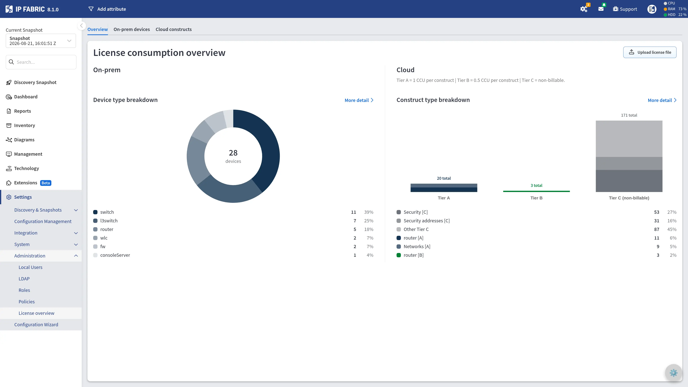
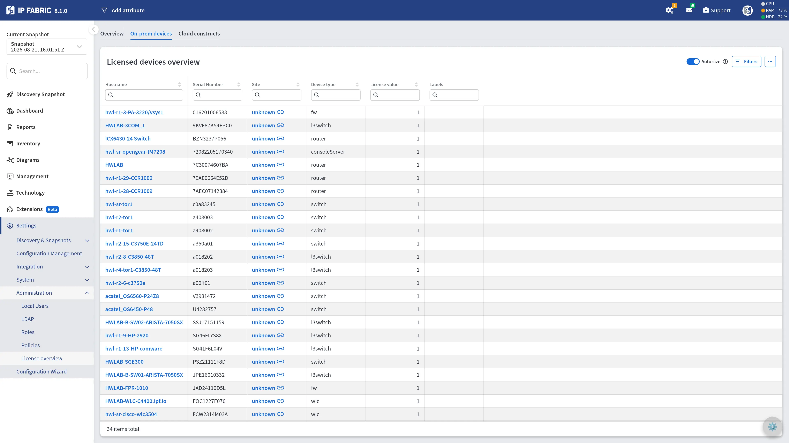
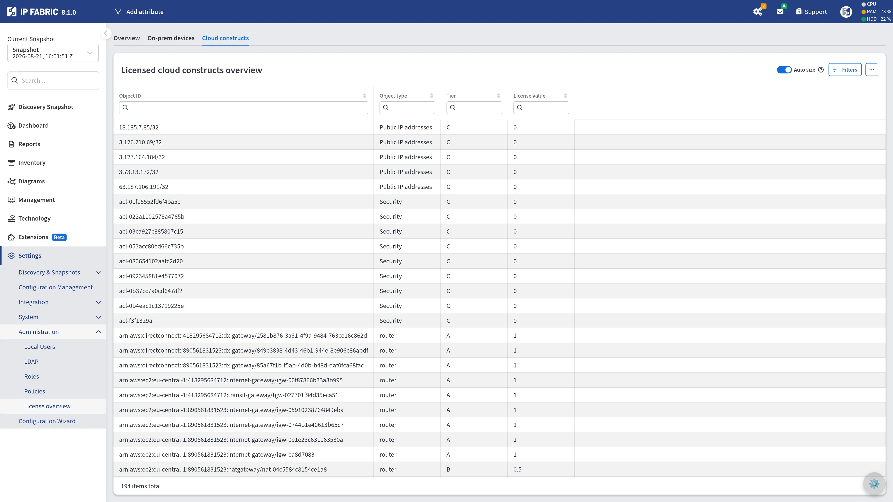

# License Consumption Overview

**Settings --> Administration --> License overview** displays how devices and cloud objects count toward license consumption. Results are grouped by device type and cloud resource type respectively.

!!! info "Cloud Licensing required"

    The License Consumption Overview is only available on discovery [Snapshots](../Discovery_and_Snapshots/snapshot_collection.md) collected with [Cloud Licensing](../../overview/licensing.md#cloud-licensing) active.

## License Consumption - On-prem devices

The On-prem devices tab provides a complete table view of all non-cloud devices and how they count toward license consumption.

## License Consumption - Cloud constructs

The Cloud constructs tab displays a complete table of all cloud objects and how they count toward license consumption.

