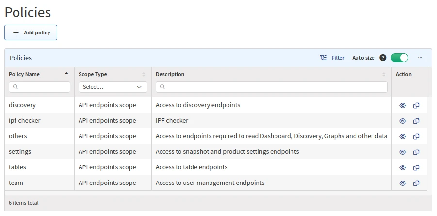

# Policies

**Policies** contain sets of either **attributes** or **endpoints**.

**Attributes scope** defines devices that are available to end users. Access is
defined by a specific attribute such as `siteName`.

**API endpoints scope** defines actions that are permitted for end users to
perform on allowed devices or on the system. Access is defined only to a
**specific API endpoint** within IP Fabric (e.g., a _discovery_ policy allows
access to discovery API endpoints (actions)).

The **Policies** section (in **Settings --> Administration --> Policies**)
allows you to create or modify policies.

!!! attention

    Every `custom role` must have at least two policies configured to see
    diagrams:

      1. An **attributes scope** policy defining `siteName`s.

      2. An **API endpoints scope** policy defining access to `Graphs` API
         calls.

    Users with the `admin` role have access to all attributes and endpoints by
    default.

!!! note "`ipf-checker` Policy"

    You may ignore the `ipf-checker` (API endpoints scope) policy, which is used
    by our internal diagnostics tool.

## Add Attributes Scope Policy

1. To add a new policy, click **+ Add policy**:

   

2. Click **Attributes scope**:

   

3. Set a policy name, add attributes (create filters), select values, and click
   **Save**:

   

## Add API Endpoints Scope Policy

1. To add a new policy, click **+ Add policy**:

   

2. **API endpoints scope** should be selected by default:

   

3. Set a policy name, select API endpoints, and click **Save**:

   

## List of Policies

The `Policies` table lists all policies including their details and allows you
to **modify** or **delete** them _(except for the built-in policies, which
cannot be modified or deleted)_.

## Edit Policy

1. To modify the details of a policy, click the **Edit** icon next to it in the
   `Policies` table:

   

2. Update the data in the **Edit policy** form and click **Save**:

   

## Copy Policy

1. To copy a policy, click the **Copy** icon next to it in the `Policies` table:

   

2. Update the data in the **Copy policy** form and click **Save**:

   

## Delete Policy

1. To delete a policy, click the **Delete** icon next to it in the `Policies`
   table:

   

2. To confirm the action, click **Delete**:

   
