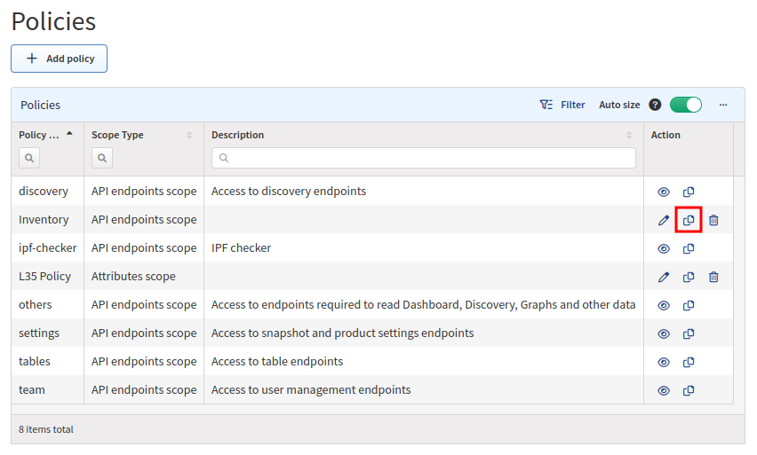

# Policies

**Policies** can contain sets of **attributes or endpoints**.

**Attributes Scope** defines devices which are available to end users. Access is defined by a specific attribute such as **siteName**.

**API Endpoints Scope** defines actions which are permitted to end users to perform on allowed devices or in the system. Access is defined only to a **specific API endpoint** within the IP Fabric (e.g. *discovery* policy allows access to discovery API endpoints (actions)).

**Policies page** enables you to create or modify policies.

!!! attention

	Every `custom role` has to have at least 2 policies configured to see diagrams.
		
	  1. **Attributes Scope** policy defining `siteNames`
		
	  2. **API Endpoints Scope** policy defining access to **Graphs** API calls.

	Users with `admin` role have access to all attributes and endpoints by default.

## Add Attributes Scope Policy

1. To add a new policy click **+ Add policy**.

	

2. By default the **Attributes scope** will be selected.

	

3. Set a policy name, add attributes (create a filters), select values and **save** your attribute policy.

	

## Add API Endpoint Policy

1. To add new policy click **+ Add policy**.

	

2. Select **Api endpoints scope** 

	

3. Set a policy name, select API endpoints and **save** your endpoints scope.

## List of Policies

**Policies table** lists all policies including their details and enables you to **modify** or **delete** them _(with exception for built-in policies which cannot be modified or deleted)_.

## Edit Policy

1. To modify policy details, click **edit icon** in policies table.

	

2. Then to modify policy details update data in **Edit Policy** form and click **Save**.

	

## Copy Policy

1. To copy policy, click **copy icon** in policies table.

	

2. Then modify policy details in **Copy Policy** form and click **Save**.

	

## Delete Policy

1. To delete policy, click **delete icon** in table.

	

2. Then click **Delete** to confirm action.

	
