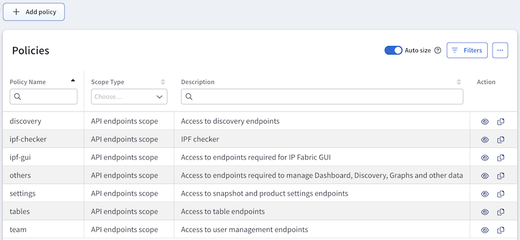
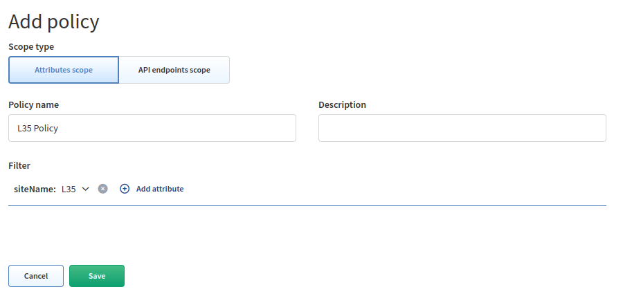

# Policies

**Policies** can contain sets of **attributes or endpoints**.

**Attributes scope** defines devices which are available to end users. Access is
defined by a specific attribute such as **siteName**.

**API endpoints scope** defines actions which are permitted for end users to
perform on allowed devices or on the system. Access is defined only to a
**specific API endpoint** within IP Fabric (e.g., _discovery_ policy allows
access to discovery API endpoints (actions)).

The **Policies** page allows you to create or modify policies.

!!! attention

    Every `custom role` has to have at least 2 policies configured to see
    diagrams:

      1. **Attributes scope** policy defining `siteName`s

      2. **API endpoints scope** policy defining access to **Graphs** API calls

    Users with `admin` role have access to all attributes and endpoints by
    default.

## Add Attributes Scope Policy

1. To add a new policy, click **+ Add policy**:

   

2. Click **Attributes scope**:

   

3. Set a policy name, add attributes (create filters), select values, and
   **save** your attributes scope policy:

   

## Add API Endpoints Scope Policy

1. To add a new policy, click **+ Add policy**:

   

2. **API endpoints scope** should be selected by default:

   

3. Set a policy name, select API endpoints and **save** your API endpoints scope
   policy:

   

## List of Policies

The **Policies** table lists all policies including their details and allows
you to **modify** or **delete** them _(with the exception of the built-in
policies which cannot be modified or deleted)_.

## Edit Policy

1. To modify the details of a policy, click the **Edit** icon next to it in the
   **Policies** table:

   

2. Update the data in the **Edit policy** form and click **Save**:

   

## Copy Policy

1. To copy a policy, click the **Copy** icon next to it in the **Policies**
   table:

   

2. Update the data in the **Copy policy** form and click **Save**:

   

## Delete Policy

1. To delete a policy, click the **Delete** icon next to it in the **Policies**
   table:

   

2. Click **Delete** to confirm the action:

   
