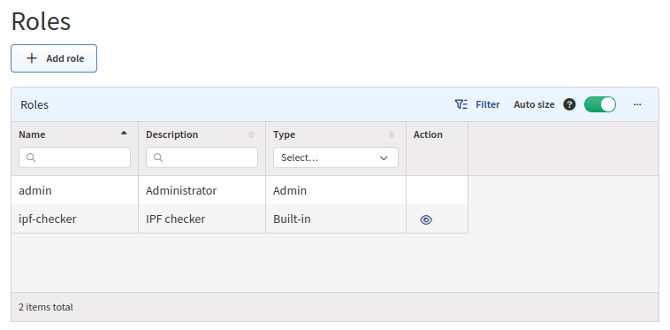
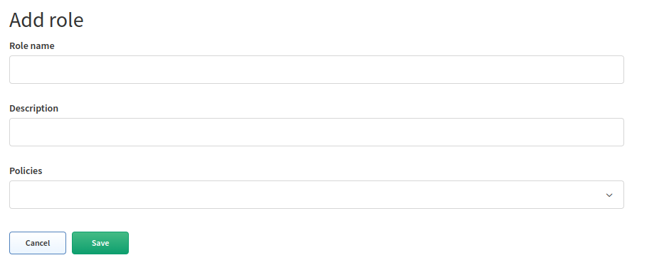
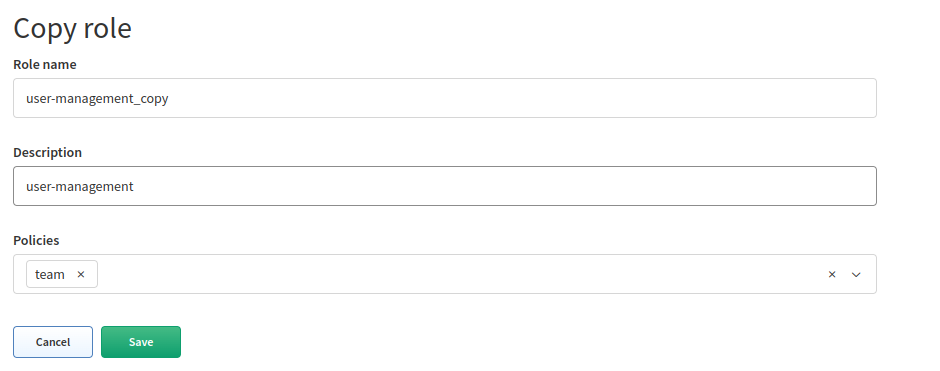
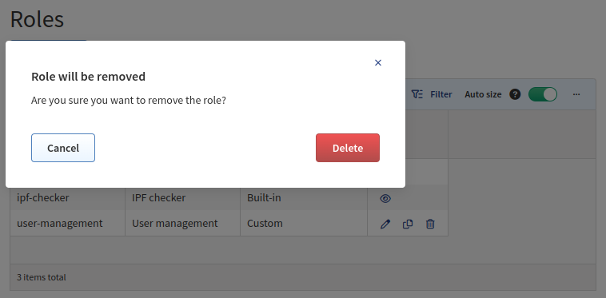

# Roles

**Roles** allow users to perform actions on system resources (e.g., a
_user-management_ role with the _team_ policy assigned allows users to view,
add, update, or delete `users`, `roles`, `policies`, and `LDAP configuration`).

The **Roles** section (in **Settings --> Administration --> Roles**) allows you
to create or modify roles.

!!! note "`ipf-checker` Role"

    You may ignore the `ipf-checker` role, which is used by our internal
    diagnostics tool.

## Add Role

1. To add a new role, click **+ Add role**:

   

2. Set a role name, description, select policies, and click **Save**:

   

## List of Roles

The `Roles` table lists all roles, including their details, and allows you to
**modify** or **delete** them _(except for the built-in **admin** and
**ipf-checker** roles, which cannot be modified nor deleted)_.

## Edit Role

1. To modify the details of a role, click the **Edit** icon next to it in the
   `Roles` table:

   

2. Update the data in the **Edit role** form and click **Save**:

   

## Copy Role

1. To copy a role, click the **Copy** icon next to it in the `Roles` table:

   

2. Update the data in the **Copy role** form and click **Save**:

   

## Delete Role

1. To delete a role, click the **Delete** icon next to it in the `Roles` table:

   

2. To confirm the action, click **Delete**:

   
