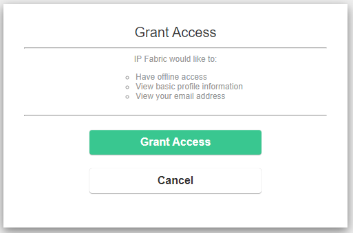

# Single Sign-On (SSO)

!!! warning "Outdated SSO User Records in IP Fabric Might Cause Login Issues"

    With SSO configured, each sign-in of a new user into IP Fabric via SSO will
    create a new (non-local) user record in **Settings --> Administration -->
    Local Users** -- with the user's current username and email from the
    Identity Provider (IdP).

    If the user's username or email changes on the IdP side, the user will
    encounter an `Authentication Failure` while logging in to IP Fabric via SSO
    -- due to a username/email mismatch between the IdP and IP Fabric.

    In that case, please remove the outdated user record of that user in
    **Settings --> Administration --> Local Users**.

IP Fabric includes support for Single Sign-On (SSO). We have opted for
[Dex](https://dexidp.io/) (a federated OpenID Connect provider) as a key
building block to allow a broader set of Identity Providers (IdP).


!!! warning "Complex Configuration"

    Configuring SSO can be a complex task. Due to that, it is recommended to
    have it configured by your Solution Architect. If you are unsure who your
    Solution Architect is, please contact our Support team.

## Requirements

### Certificate

Prior to configuring SSO, the IP Fabric server must not be using a self-signed
certificate. To create a new signed TLS certificate, please see the instructions
in [IPF Certificates](../system/ipf_cert.md).

!!! information "Private Certificate Authority (CA)"

    IP Fabric only trusts certificates issued by CAs listed in the system
    `openssl` trust-store. If your company uses certificates signed by an
    internal CA, please see the instructions in [Certificate Authorities](../system/ca.md)
    as your CA certificate will need to be added to the system's trust-store.

### CLI Access

To make changes to certain files, you must log in to the IP Fabric CLI as the
`osadmin` user and gain `root` access. For more information, please see the
[CLI Overview](../../System_Administration/Command_Line_Interface/index.md).

```bash
justin@ubuntu:~$ ssh osadmin@demo.ipfabric.io
osadmin@demo:~$ sudo -s
[sudo] password for osadmin:
root@demo:/home/osadmin#
```

## API Configuration `api.json`

The IP Fabric API configuration is stored in `/opt/ipf-api/conf.d/api.json`. This
file needs to be created during the initial configuration, as it does not exist
in the default image. It will also be persistent during upgrades and will not be
changed. Below is a full example of the `api.json` config file:

```json
{
  "app": {
    "url": "https://<FQDN>/api"
  },
  "web": {
    "url": "https://<FQDN>"
  },
  "dex": {
    "url": "https://<FQDN>/dex",
    "providers": [
      {
        "name": "sso",
        "clientId": "ipfabric",
        "clientSecret": "<RANDOM_SECRET>",
        "roleAssignments": [
          {
            "groupName": "any",
            "roleId": null
          },
          {
            "groupName": "read-only-group-SSO",
            "roleName": "read-only-role-IPF"
          },
          {
            "groupName": "admin-group-SSO",
            "roleName": "admin"
          }
        ]
      }
    ]
  }
}
```

??? example "JSON Validation"

    The example below is a malformed JSON due to the comma after `app.url`:

    ```json
    {
      "app": {
        "url": "https://demo.ipfabric.io/api",
      },
      "web": {
        "url": "https://demo.ipfabric.io"
      },
      "dex": {
        "url": "https://demo.ipfabric.io/dex",
        "providers": []
      }
    }
    ```

    Using the `jq` command, it is easy to discover JSON errors instead of
    searching through log files or `journalctl` output.

    ```bash
    root@demo:~$ jq . /opt/ipf-api/conf.d/api.json
    parse error: Expected another key-value pair at line 4, column 3
    ```

    You can reformat and prettify the JSON file by running:

    ```bash
    echo "$(jq < /opt/ipf-api/conf.d/api.json)" > /opt/ipf-api/conf.d/api.json
    ```

### URL Configuration

Inside the `app`, `web`, and `dex` sections, the `url` fields need to be updated
with the FQDN of the IP Fabric system.

The `dex.url` must match the [`ipf-dex.yaml`](#issuer) issuer URL.

Example:

```json
{
  "app": {
    "url": "https://demo.ipfabric.io/api"
  },
  "web": {
    "url": "https://demo.ipfabric.io"
  },
  "dex": {
    "url": "https://demo.ipfabric.io/dex"
  }
}
```

### Providers Configuration

The `providers` section must contain at least one SSO provider (which
corresponds to `staticClient` in the Dex configuration).

```json
{
  "dex": {
    "providers": [
      {
        "name": "sso",
        "clientId": "ipfabric",
        "clientSecret": "jqv-W_khLSwJdJMHCjhJefyu-QdeXq9kcz8sAfMrO1Q",
        "roleAssignments": [
          {
            "groupName": "any",
            "roleId": null
          },
          {
            "groupName": "admin",
            "roleId": "admin"
          },
          {
            "groupName": "read",
            "roleId": "2356575453"
          },
          {
            "groupName": "read-only-users",
            "roleName": "read-only-users"
          }
        ]
      }
    ]
  }
}
```

- `name` -- User-defined name of the Identity Provider (IdP) displayed in the
  GUI.

  - Can only contain `a-z` `0-9` `_`. **Do not use uppercase.**
  - Used in [`ipf-dex.yaml`](#static-clients) for `redirectURIs` under
    `staticClients`.
  - This name will be displayed on the login page of the GUI. This name will be
    capitalized (e.g., `sso` --> `Sso`); therefore, it is recommended to use
    names such as `azure` or `okta`.

    

- `clientId` -- User-defined value. Suggested to keep `ipfabric`.
  - Used in [`ipf-dex.yaml`](#static-clients) for `id` under `staticClients`.
- `clientSecret` -- User-defined value for a secret shared only between
  IP Fabric and Dex.

  - Can be randomly created for instance using Python:

    ```bash
    python -c "import secrets; print(secrets.token_urlsafe())"
    ```

  - Used in [`ipf-dex.yaml`](#static-clients) for `secret` under
    `staticClients`.

- `roleAssignments` -- An array of objects.
  - Objects are in the format of
    `{groupName: string, roleId?: string|null, roleName?: string|null }`
    - `groupName` -- The name of the group that is configured on the SSO side.
      - `any` will provide access to any user by default.
      - Multiple mappings with the same `groupName` will get merged. So the user
        will receive all corresponding roles on the IP Fabric side.
    - `roleId` -- The ID of the IP Fabric role.
      - A value of `null` will provide no access.
      - Either `roleId` or `roleName` property must be specified, not both.
      - **Please do not confuse `roleId` with `roleName` as these are different
        values. `roleId` must be retrieved using the browser's Developer Tools
        or using the API (example below).**
    - `roleName` -- The name of the IP Fabric role.
      - A value of `null` will provide no access.
      - Either `roleName` or `roleId` property must be specified, not both.
      - **Since version `6.1`, you can opt to only use `roleName` instead of
        `roleId` in your configuration.**
      - **Since version `6.3`, `roleName` can only contain `a-z` `A-Z` `0-9`
        `_-`. Previously created roles will be automatically modified by
        removing not-allowed characters from role name according to the new
        validation rules. Make sure the specified `roleName` refers to an
        existing role in the system.**

Example how to find `roleId`:


## SSO Configuration `ipf-dex.yaml`

While Dex supports various connectors, we strongly recommend using OpenID
Connect (OIDC) for SSO integration. (Azure uses a special `microsoft` connector,
and an example is provided below along with SAML.) Please check the
[official Dex documentation](https://dexidp.io/docs/connectors) for their
overview.

The Dex configuration is located in `/etc/ipf-dex.yaml` on the IP Fabric
appliance. It has several configuration sections, and a full example of the file
is provided below. Please note that OIDC, SAML, and Azure have different
syntaxes for the `connectors` configuration portion, which are covered
separately.

```yaml
# /etc/ipf-dex.yaml

issuer: https://<FQDN>/dex

staticClients:
  - id: ipfabric
    redirectURIs:
      - "https://<FQDN>/api/oauth2/external/<API-DEX-PROVIDERS-NAME>"
    name: IP Fabric
    secret: <RANDOM_SECRET>

storage:
  type: memory

logger:
  level: debug

web:
  http: 127.0.0.1:5556

telemetry:
  http: 127.0.0.1:5558

grpc:
  addr: 127.0.0.1:5557

oauth2:
  skipApprovalScreen: true

connectors:
  - type: oidc
    id: sso_oidc
    name: SSO OIDC
    config:
      issuer: <SSO_ISSUER>
      redirectURI: https://<FQDN>/dex/callback
      clientID: <SSO_CLIENT_ID>
      clientSecret: <SSO_CLIENT_SECRET>
      getUserInfo: true
      insecureEnableGroups: true
      scopes:
        - openid
        - profile
        - email
        - groups
```

!!! note "Keep Default Values"

    The following lines should be left at the default values:

    ```yaml
    storage:
      type:
        memory

    logger:
      level: debug

    web:
      http: 127.0.0.1:5556

    telemetry:
      http: 127.0.0.1:5558

    grpc:
      addr: 127.0.0.1:5557
    ```

### Issuer

In the Dex configuration, at the very top, there is an attribute called
`issuer`. This needs to be configured to be equal to the `url` under `dex` in
[`api.json`](#providers-configuration).

For example:

```yaml
issuer: https://demo.ipfabric.io/dex
```

### Skip Approval Screen

The following lines of the configuration control whether you would like a `Grant
Access` screen to be presented to your users on every login. By setting it to
`true`, the message below won't be displayed.

```yaml
oauth2:
  skipApprovalScreen: true
```



### Static Clients

The `staticClients` section contains the configuration for the IP Fabric portal,
which acts as a client to `dex`.

```yaml
staticClients:
  - id: ipfabric
    redirectURIs:
      # IPF version `<7.0.0` URL can be set to `v<Major>` only
      - "https://demo.ipfabric.io/api/v6/auth/external/sso"
      # IPF version `>=7.0.0` URL can be set without a version of the application
      - "https://demo.ipfabric.io/api/oauth2/external/sso"
    name: IP Fabric
    secret: jqv-W_khLSwJdJMHCjhJefyu-QdeXq9kcz8sAfMrO1Q
```

- `id` -- Unique ID of the client within the Dex configuration.
  - Found in [`api.json`](#providers-configuration) for `clientId` under
    `providers`.
- `redirectURIs` -- Full path to the callback endpoint of the IP Fabric client.

  - It is in the format of
    `https://<FQDN>/api/oauth2/external/<API-DEX-PROVIDERS-NAME>`
  - `API-DEX-PROVIDERS-NAME` is found in [`api.json`](#providers-configuration)
    for `name` under `providers`.

    - Can only contain `a-z` `0-9` `_`. **Do not use uppercase.**

    !!! note "`redirectURIs` After Upgrade to `7.0.0`"

        In IP Fabric versions `<7.0.0`, the `redirectURIs` only included the
        major version: `https://<FQDN>/api/v6/auth/external/sso`.

        Starting from version `>=7.0.0`, the redirect URI has been modified to
        exclude the application's version:
        `https://<FQDN>/api/oauth2/external/<API-DEX-PROVIDERS-NAME>`,
        eliminating the need for reconfiguration even after future major
        updates.

- `name` -- Arbitrary name of the client.
  - This will be displayed in the
    [`Grant Access` screen](#skip-approval-screen).
- `secret` -- User-defined secret.
  - Found in [`api.json`](#providers-configuration) for `clientSecret` under
    `providers`.
  - It is a secret shared only between IP Fabric and Dex.

### Config File Mapping

Here is a concise illustration of how the `/opt/ipf-api/conf.d/api.json` values
map to `/etc/ipf-dex.yaml`:


### OpenID Connect (OIDC)

Please review the
[Dex documentation on OIDC](https://dexidp.io/docs/connectors/oidc/) for all
configuration options and potential caveats.

!!! note "Well-Known Configuration"

    Many of the required variables can be found in the OIDC well-known
    configuration endpoint. For example, take a look at Google:
    [`.well-known/openid-configuration`](https://accounts.google.com/.well-known/openid-configuration).

```yaml
connectors:
  - type: oidc
    id: sso_oidc
    name: SSO OIDC
    config:
      issuer: <SSO_ISSUER>
      redirectURI: https://<FQDN>/dex/callback
      clientID: <SSO_CLIENT_ID>
      clientSecret: <SSO_CLIENT_SECRET>
      getUserInfo: true
      insecureEnableGroups: true
      scopes:
        - openid
        - profile
        - email
        - groups
      claimMapping:
        groups: roles
```

- `type` -- Dex connector type.
- `id` -- User-defined arbitrary ID. (Not used anywhere.)
- `name` -- User-defined arbitrary name. (Not used anywhere.)
- `redirectURI` -- `issuer` URL with `/callback` appended.
  - Can be found in [`api.json`](#url-configuration) under `dex`<br/>
    OR can be found in [`ipf-dex.yaml`](#issuer).
- `getUserInfo` -- When enabled, the OpenID Connector will query the `UserInfo`
  endpoint for additional claims.
- `insecureEnableGroups` -- Groups claims only refresh when the ID token is
  refreshed, meaning the regular refresh flow doesn't update the groups claim.
  As such, by default, the OIDC connector doesn't allow groups claims. If you
  are okay with having potentially stale group claims, you can use this option
  to enable groups claims through the OIDC connector on a per-connector basis.
- `clientID` -- A client ID configured or generated on the Identity Provider.
- `clientSecret` -- A client secret configured or generated on the Identity
  Provider.
- `scopes` -- A list of scopes to be returned from the Identity Provider.
  - The ones listed above are the most common. However, these can differ from
    provider to provider.
  - Scopes are normally found in `.well-known/openid-configuration`, which is
    discussed in the [OIDC](#openid-connect-oidc) section.
- `claimMapping` -- Some providers return non-standard claims (i.e., roles). Use
  `claimMapping` to map those claims to standard claims.

### Azure

!!! warning

    Please review the
    [Dex documentation on Azure](https://dexidp.io/docs/connectors/microsoft/)
    for all configuration options and potential caveats, as Azure requires
    special configuration for proper enablement.

#### Dex Config

```yaml
connectors:
  - type: microsoft
    id: sso_azure
    name: SSO Azure
    config:
      clientID: <SSO_CLIENT_ID>
      clientSecret: <SSO_CLIENT_SECRET>
      redirectURI: https://<FQDN>/dex/callback
      tenant: <TENANT_ID>
      scopes:
        - openid
        - profile
        - email
      claimMapping:
        groups: roles
```

- `type` -- Dex connector type.
- `id` -- User-defined arbitrary ID. (Not used anywhere.)
- `name` -- User-defined arbitrary name. (Not used anywhere.)
- `redirectURI` -- `issuer` URL with `/callback` appended.
  - Can be found in [`api.json`](#url-configuration) under `dex`<br/>
    OR can be found in [`ipf-dex.yaml`](#issuer).
- `tenant` -- UUID or name of the specific tenant to which accounts belong.
  - **Required for obtaining the `groups` claim from Azure.**
- `clientID` -- A client ID configured or generated on the Identity Provider.
- `clientSecret` -- A client secret configured or generated on the Identity
  Provider.
- `scopes` -- A list of scopes to be returned from the Identity Provider.
  - The ones listed above are the most common. However, these can differ from
    provider to provider.
  - Scopes are normally found in `.well-known/openid-configuration`, which is
    discussed in the [OIDC](#openid-connect-oidc) section.
- `claimMapping` -- Some providers return non-standard claims (i.e., roles). Use
  `claimMapping` to map those claims to standard claims.

#### Azure AD App Registration Auth Using OIDC

1. From the **Azure Active Directory --> App registrations** menu, select `+ New
registration`.

2. Enter a `Name` for the application. E.g., `IP Fabric SSO`.

3. Specify who can use the application. E.g., `Accounts in this organizational
directory only`.

4. Enter Redirect URI _(optional)_ as follows (replace `IP_FABRIC_FQDN` with
   your IP Fabric URL), then select `Add`.

   - **Platform:** `Web`
   - **Redirect URI:** https://`<IP_FABRIC_FQDN>`/dex/callback

5. When the registration finishes, the Azure portal displays the app
   registration's Overview pane. You will see the Application (client) ID.

   

6. From the **Certificates & secrets** menu, select `+ New client secret`.

7. Enter a `Name` for the secret. E.g., `clientSecret`. **Make sure to copy and
   save the generated value for the `clientSecret`.**

   

8. From the **API permissions** menu, select `+ Add a permission`.

9. Find the `User.Read` permission (under `Microsoft Graph`) and grant it to the
   created application:

   

10. From the **Token Configuration** menu, select `+ Add groups claim`:

    

    - `All groups`: Emits security groups, distribution lists, and roles.

    - `Security groups`: Emits security groups of which the user is a member in
      the groups claim.

    - `Directory roles`: If the user is assigned directory roles, they're emitted
      as a `wids` claim. (The group's claim won't be emitted.)

    - `Groups assigned to the application`: Emits only the groups which are
      explicitly assigned to the application and of which the user is a member.
      **Recommended for large organizations due to the group number limit in
      token.**

11. From the **Azure Active Directory --> Enterprise applications** menu, search
    for the app that you created. E.g., `IP Fabric SSO`.

12. From the **Users and groups** menu of the app, add any users or groups
    requiring access to the service.

### SAML Connector

!!! danger "SAML Connector is obsolete"

    SAML is not recommended, please use OpenID Connect (OIDC) or
    OAuth2 instead.

Please review the
[Dex documentation on SAML](https://dexidp.io/docs/connectors/saml/) for all
configuration options and potential caveats.

```yaml
connectors:
  - type: saml
    id: sso_saml
    name: SSO SAML
    config:
      ssoURL: <SSO_URL>
      ssoIssuer: <SSO_ISSUER>
      redirectURI: https://<FQDN>/dex/callback
      caData: "LS0t ... 0tLS0tCg=="
      # ca: /path/to/file
      usernameAttr: name
      emailAttr: email
      groupsAttr: groups
      nameIDPolicyFormat: emailAddress
```

- `type` -- Dex connector type.
- `id` -- User-defined arbitrary ID. (Not used anywhere.)
- `name` -- User-defined arbitrary name. (Not used anywhere.)
- `redirectURI` -- `issuer` URL with `/callback` appended.
  - Can be found in [`api.json`](#url-configuration) under `dex`<br/>
    OR can be found in [`ipf-dex.yaml`](#issuer).
- `ssoURL` -- SSO URL used for POST value.
- `ssoIssuer` -- _(optional)_ Issuer value expected in the SAML response.
- Pick and use one of the following options to validate the signature of the
  SAML response:
  - `caData` -- Base64-encoded certificate chain.
  - `ca` -- Path to the file containing the certificate chain.

  !!! tip "Recommendation"
      It is recommended to store the **SAML CA (PEM) certificate** in the `/home/autoboss/` directory with file permissions set to `644`.
      
      To set the correct permissions, run:
	
      ```bash
      chmod 644 /home/autoboss/<file-name>
      ```

- `usernameAttr` -- Maps SAML `name` value to IP Fabric's `username`.
- `emailAttr` -- Maps SAML `email` value to IP Fabric's `email`.
- `groupsAttr` -- Maps SAML `groups` value to IP Fabric's `groupName`.
- `nameIDPolicyFormat` -- The connector uses the value of the `NameID` element
  as the user's unique identifier, which Dex assumes is both unique and
  never-changing. Use `nameIDPolicyFormat` to ensure this is set to a value
  which satisfies these requirements.

### YAML Validation

While the validity of the actual configuration is determined by Dex itself, it
can be handy to verify parsing of the configuration YAML. You can use the
following command to get a JSON representation of `/etc/ipf-dex.yaml`:

```bash
python3 -c 'import sys, yaml, json; y=yaml.safe_load(sys.stdin.read()); print(json.dumps(y))' < /etc/ipf-dex.yaml  | jq .
```

??? example "Correct YAML"

    Let's assume the following YAML fragment as an input:

    ```yaml
    connectors:
      - type: microsoft
        id: sso_azure
        config:
          scopes:
            - openid
            - profile
            - email
            - groups
    ```

    The output of the command will be:

    ```json
    {
      "connectors": [
        {
          "type": "microsoft",
          "id": "sso_azure",
          "config": {
            "scopes": [
              "openid",
              "profile",
              "email",
              "groups"
            ]
          }
        }
      ]
    }
    ```

    As you can see, `scopes` has been correctly parsed as a list.

??? example "Incorrect YAML"

    Let's assume the following YAML fragment as an input:

    ```yaml
    connectors:
      - type: microsoft
        id: sso_azure
        config:
          scopes:
          - openid
            - profile
            - email
            - groups
    ```

    The output of the command will be:

    ```json
    {
      "connectors": [
        {
          "type": "microsoft",
          "id": "sso_azure",
          "config": {
            "scopes": [
              "openid - profile - email - groups"
            ]
          }
        }
      ]
    }
    ```

    As you can see, `scopes` has been completely incorrectly parsed as a
    multiline string.

## Restarting Services

After making changes to `/opt/ipf-api/conf.d/api.json`, you need to restart the
API service:

```bash
systemctl restart ipf-api.service
```

Consequently, after making changes to `/etc/ipf-dex.yaml`, you need to restart
the Dex service:

```bash
systemctl restart ipf-dex.service
```

## Debugging Dex

Dex logs can be found in `/var/log/syslog`.

```shell title="Example successful login message"
~# grep 'connector_id=' /var/log/syslog
Oct  3 12:30:37 ipf-server dex[692]: time=2024-10-03T12:30:37.496Z level=INFO msg="login successful" connector_id=sso username="IPF User" preferred_username="" email=ipf.user@ipfabric.io groups="[Everyone Solution Architecture]"
```

The groups attribute must be returned in order for IP Fabric to match the role assignment in the
`/opt/ipf-api/conf.d/api.json` file. Please note that group names can have spaces like in the example above and that
`Everyone` and `Solution Architecture` are two separate groups. It is best to consult the SSO provider for the group
names as the log messages can be difficult to read.

```json
{
  "roleAssignments": [
    {
      "groupName": "Solution Architecture",
      "roleName": "admin"
    }
  ]
}
```

If groups are not returned from the SSO provider the following configuration will allow any authenticated user to be
mapped to the example `read-only` IP Fabric role.

```json
{
  "roleAssignments": [
    {
      "groupName": "any",
      "roleName": "read-only"
    }
  ]
}
```
