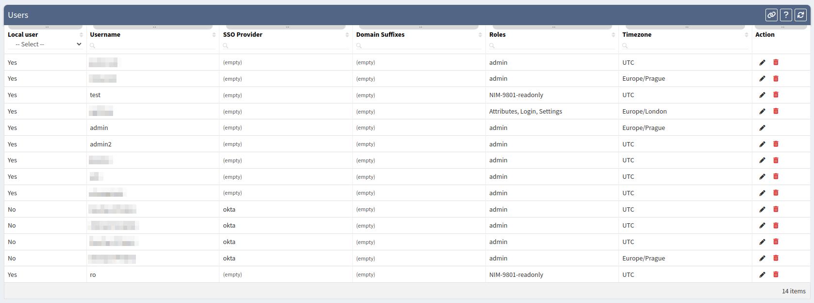
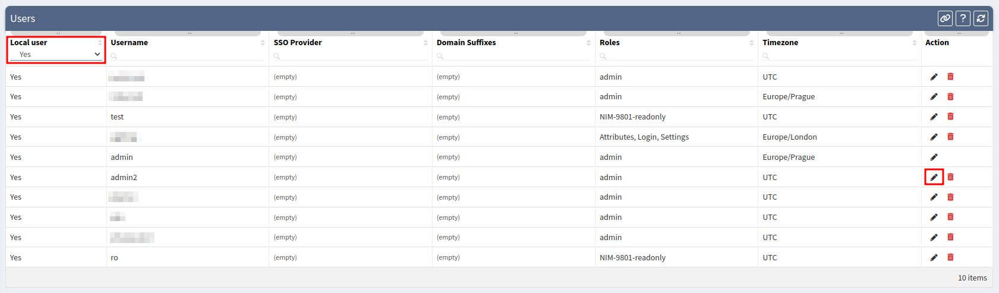
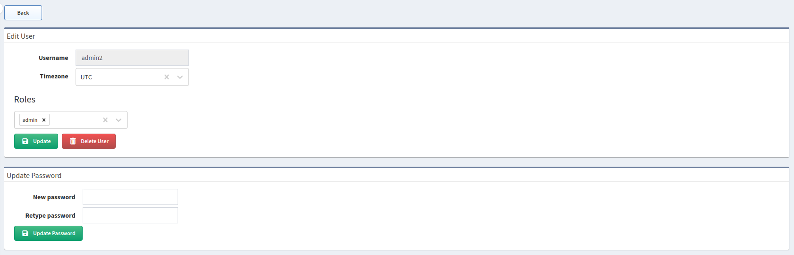
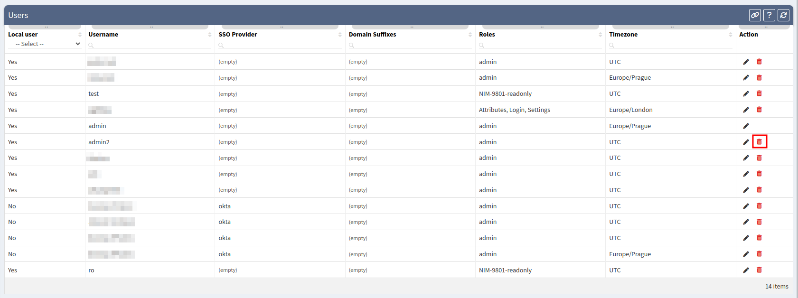

# Local Users

**Settings --> Administration --> Local Users** allows you to create or modify local users as well as to modify LDAP and SSO accounts.

## Add Local User

To add a new user, fill the **Add Local User** form and click **Save**.

To access IP Fabric, the new user has to have one or more **Roles** assigned.

Users with no assigned **Roles** will get the `API_INSUFFICIENT_RIGHTS` error upon logging in or accessing the API.

To add or modify **Roles**, follow the instructions at [Roles](roles.md).

## List of Users

The **Users** table lists all local and non-local (LDAP and SSO) users including their details and allows you to modify or delete them. _(Exception: A currently logged-in user cannot delete their account.)_

## Edit Local User

1. To modify a local user's details or password, find the user in the **Users** table and click the **Edit** icon. (Optionally, you may select `Yes` in the `Local user` column header to show only local users.)

	

2. Then to modify the user's details, update data in the **Edit User** form and click **Update**.
3. Or to modify the user's password, fill the **Update Password** form and click **Update Password**.

	

## Edit LDAP/SSO User

LDAP/SSO users have **Roles** assigned via the LDAP/SSO configuration, hence it's not possible to modify their **Roles** in the UI (unlike local users).

1. To edit a LDAP/SSO user, find the user in the **Users** table and click the **Edit** icon. (Optionally, you may select `No` in the `Local user` column header to show only non-local users.)

	

2. Then to modify the user's details, update data in the **Edit User** form and click **Update**.

	

## Delete User

1. To delete a user, find the user in the **Users** table and click the **Delete** icon.

	

2. In the confirmation dialog, click the **Delete** button.

	

Deleting a user is also possible by clicking the **Delete User** button when editing that user.

## Disable Local User's Access

To disable a local user's access to IP Fabric, follow the steps in [Edit Local User](#edit-local-user) and remove all **Roles** assigned to that user.
