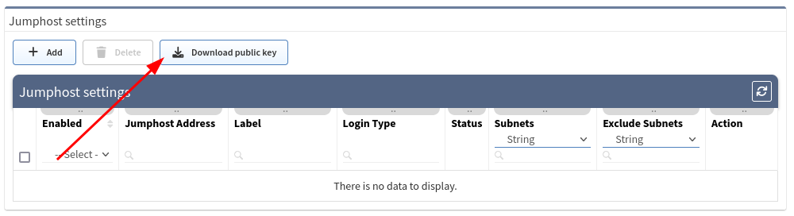

# SSH/TELNET

## Fine-Tune SSH/telnet CLI Parameters

The IP Fabric's discovery is primarily using Command Line Interface
(CLI) to discover network elements. There are certain default CLI
parameters that can be found in **Settings → Advanced → SSH/TELNET**.

### Network Device Login Timeout

Timeout before the logging prompt is received. It may take longer for
remote branches over low-speed lines, or destined to overloaded devices.

### Network Device Session Timeout

Too many **Command Timeout** errors during the Discovery process may
indicate that **Network device session timeout** is too short and it
may be necessary to expect a delay for a response to arrive.

### Maximum Number Of Parallel Sessions

To prevent flooding your network with too many SSH/TELNET sessions set
**Maximum number of parallel sessions**. This setting can be also
helpful if the AAA server (TACACS/Radius) has a limit of parallel AAA
requests for users.

In rare cases, the Cisco ISE or similar systems may rate limit the
command authorization. When there are too many authorization failures
and Cisco ISE is in place, try to limit the number of parallel sessions
down to 10 and steadily increase.

### Basic Failure

How many times to retry a connection for any error, except
authentication failure.

### Authentication Failure

**Authentication failure** can occur even if a user is authorized to
login but may happen, for example, when an AAA server is overloaded or
an authentication packet is lost.

### Command Authorization Failure Retries

If you see many examples of **Authentication error** during the
Discovery process, please adjust **Authentication failure** and
**Command Authorization Failure retries**.

### Example Of Error Message In Connectivity Report

According to the summary of issues in the very first completed snapshot,
the CLI Settings can be adjusted. Here are some of the most common
errors and adjustments:

| Error                                                                           | Error Type                    | How To Mitigate                                                                                                    |
| ------------------------------------------------------------------------------- | ----------------------------- | ------------------------------------------------------------------------------------------------------------------ |
| connect ETIMEDOUT XX.XX.XX.XX:22                                                | Connection error              | Received no response from the destination.                                                                         |
| connect ECONNREFUSED XX.XX.XX.XX:22                                             | Connection error              | The connection to the destination is being blocked by an access-list or firewall.                                  |
| All configured authentication methods failed                                    | Authentication error          | Unable to authenticate to the destination host                                                                     |
| Authentication failed                                                           | Authentication error          | Unable to authenticate to the destination host                                                                     |
| Authentication failed - login prompt appeared again                             | Authentication error          | Unable to authenticate to the destination host                                                                     |
| SSH client not received any data for last 120000 ms! cmd => show vrrp  \| e #^$ | Command timeout               | The command 'show vrrp  \| e #^$' timed out. Increase **device session timeout.**                                  |
| Can't detect prompt                                                             | Command timeout               | Unable to detect CLI prompt. Increase **network device login timeout.**                                            |
| Command "enable" authorization failed, tried 2x                                 | Command authorization failure | The command wasn't authorized. **Increase command authorization failure retries** or increase the timer value (ms) |

## Setting Up Jumphost

**Jumphost** allows to set-up connection to the server which can be used as a **proxy server for discovery** purposes. IP Fabric uses an SSH tunnel established by python on the client and the server side.

We successfully tested IP Fabric against jumphosts with the following python versions:

| Python version on the jumphost |              |
| ------------------------------ | ------------ |
| 2.7                            | tested       |
| 3.4                            | tested       |
| 3.5                            | tested       |
| 3.6                            | supported    |
| 3.7                            | supported    |
| 3.8                            | supported    |
| 3.9                            | supported    |
| 3.10                           | tested       |

tested -- jumphost was tested and it seems to work, but it is not officially supported by underlying project and might have subtle issues

supported -- jumphost was tested, it works and also underlying project supports it officially

We strongly recommend using **python 3.6-3.9** on the jumphost side as it is officially supported by the underlying SSH tunnel tool project.

!!! warning
    Please bear in mind, that once the connection is established, it will be enabled permanently, until disabled or removed! If there are any network issues, IP Fabric software will try to establish a connection periodically.

!!! important
    At least one seed IP address has to be provided as a starting point behind Jumphost in seed configuration.

### Adding New Jumphost

1. Open jumphost settings, using item **Settings → Advanced → SSH/TELNET**
2. At the bottom of the page, please select **+ Add** button

    

3. Fill in all necessary data
    1. **Label** - the name for configuration (mandatory)
    2. **Jump host Address** - IP address of FQDN name (mandatory)
    3. **IPv4 subnets** - subnet in CIDR representation, allows adding more than open, separated with spaces (mandatory)
		
		!!! Warning

			If you use `0.0.0.0/0` or another subnet that **includes IP address of the IP Fabric**, please make sure to **add IP Fabric IP address/subnet** to **"Exclude IPv4 subnet"**. Otherwise, IP connection to IP Fabric will be lost and you **will not** be able to **access IP Fabric GUI/CLI** and it will require manual intervention (on OS level most probably from our support) to fix.

    4. **Exclude IPv4 subnets** - subnet to exclude in CIDR representation, allows to add more than open, separated with spaces (optional)
    5. **Login type**
        1. **Use credentials** - require to provide username and password
        2. **Use SSH keys** - if you copied ssh public key to the proxy server, it won’t require providing a password (please jump to the _SSH key configuration_ section)
    6. **Username** - Username for authentication (mandatory)
    7. **Password** - password for authentication (mandatory if ‘Use credentials’ is used) i.e., refer to the picture below
       
	!!! Info
		Password can contain only the following characters `A-Za-z0-9.,/-_@%^:=+`
	
	

4. Click **+ Add** button
5. If a connection is open, you will see the **_Running_** status in Jumphost list
 
    

### SSH Key Configuration

!!! info
    Adding ssh key to proxy server allows you to avoid using passwords for authentication

1. Download ssh key from Jumphost settings

    

2. Save `jumphost-public-key.pub`

3. Copy file content to `authorized_keys` file of the user that
   will authenticate with Jumphost server. Please follow official
   documentation at <https://www.ssh.com/ssh/authorized-key>

4. Restart `sshd` service to apply settings

5. If the key has been copied you can use the option _‘Use SSH keys'_
   while adding a new Jumphost server, instead of _'Use credentials’_

### Disabling Jumphost Connection

1. Edit configuration that needs to be disabled, i.e.\

    

2. Change the setting to **Disabled**,

3. Click the **Update** button

    

### Remove Jumphost Configuration

1.  On Jumphost servers list, check configuration that needs to be
    removed

2.  Click **Delete** button

    

## Jumphost Known Issues

### Non-TCP Discovery

Only TCP connections work through the jumphost.

Traceroute with ICMP is not supported so the discovery process might not be able to get over the unreachable parts of the network (for example sites separated by the provider’s network).

Because of this you will have to add at least one IP address of a network device from each site to the [Discovery seeds](../discovery_seed.md) settings.

### IP Fabric Is Not Accessible After Saving Jumphost Configuration

If you can't open the main GUI or SSH to the IP Fabric machine, the subnet/IP address of the IP Fabric machine was most likely included in the jumphost configuration.

To fix this issue, you have to have a **direct access** to the **virtual machine CLI** from a hypervisor, know password for `osadmin` user account, and do the following:

1. Login with `osadmin` account to the **virtual machine CLI**

2. Filter out the **jumphost** services with `systemctl | grep jumphost` command

	!!! info
		Each configured jumphost has its own ID

	

3. **Stop the jumphost service** with command `sudo systemctl stop jumphost@xxxx.service`, confirm the `osadmin` password

	

4. Check that the **jumphost process is inactive** with `systemctl status jumphost@xxxx.service` command

	

5. IP Fabric GUI should be accessible by now.

6. Login into to the **IP Fabric main GUI** with your regular account and go to **Settings → Advanced → SSH/Telnet**.

7. Make a screenshot or copy the settings of the old jumphost and then delete or edit the jumphost settings.

	

8. Put **IP address/subnet of the IP Fabric** machine to the **exclude IPv4 subnets** or **edit** the **IPv4 subnets** so it does **not contain the IP address of IP Fabric**.

	

!!! info
    If **IP Fabric** becomes inaccessible via GUI or SSH again, repeat the previous steps and again edit the jumphost configuration.

## Custom SSH/Telnet Ports

!!! info
    Custom SSH/Telnet ports settings enable the discovery process to use different than standard ports for connecting. The standard for SSH is port 22 and 23 for Telnet.

In the following example we configure the discovery process to use port `8080`
for SSH connections to `192.168.168.10`:

As a result of such configuration, we would create a new item under the
**Custom SSH/Telnet ports** configuration, which will be applied to every
new snapshot created by IP Fabric.

## Telnet/SSH URL Handler On MS Windows 7 And Later

If you want to be able to connect directly to a device from the IP Fabric web
interface, you need to register a Telnet/SSH URL handler. You will be touching
Windows Registry, please be sure, that you know what you are doing, have
appropriate backups and are comfortable in doing so.

### Backup Windows Registry

1. Click `Start`, type `regedit.exe` in the search box, and then press `Enter`
1. In Registry Editor, click **File → Export**
1. In the Export Registry File box, select the location where you want to save the backup copy, name your back up file and click *Save*

### Putty

#### Download Putty

1. Go to <https://www.chiark.greenend.org.uk/~sgtatham/putty/latest.html>
1. Download `Putty`
1. This tutorial expects Putty in `C:\Program Files (x86)\putty.exe`

#### Register Telnet/SSH URL Handler

1. Go to <https://gist.github.com/sbiffi/11256316>
1. Download `putty.reg` file
1. Edit path to Putty if differs from `C:\Program Files (x86)\putty.exe`
1. Download `putty.vbs` (save it to `C:\putty.vbs` or change this path in `putty.reg` above)
1. Edit path to Putty if differs from `C:\Program Files (x86)\putty.exe`
1. Launch `putty.reg` to associate `ssh://` and `telnet://` to this script

### SecureCRT

#### Download SecureCRT

SecureCRT is not free software. To obtain SecureCRT license please visit <https://www.vandyke.com/products/securecrt/>

#### Register Telnet/SSH URL Handler

1.  Download [securecrt.reg](ssh/securecrt.reg)
1.  Edit path to SecureCRT if differs from `C:\Program Files\VanDyke Software\SecureCRT\SecureCRT.exe`
1.  Launch `securecrt.reg` to associate `ssh://` and `telnet://` to this script
