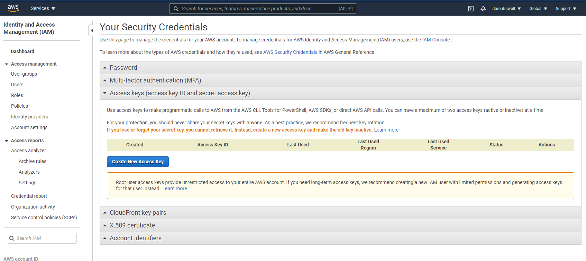

# AWS (Amazon Web Services)

Starting version 3.8.0 IP Fabric supports AWS API.

To add AWS to the discovery you will need an access key & secret access
key from your AWS account.

Those keys can be found/generated under your account in the AWS
dashboard.

Click on **My Security Credentials** and open **Access keys** tab.

To generate keys click on **Create New Access Key** and your keys will be
generated. These access keys are available globally for all of yours AWS
regions.

Copy those keys to the AWS API settings in your IP Fabric and don't
forget to **fill the regions where the devices which you want to discover
are**. Multiple regions can be set for one API key and secret.

!!! info
    To ensure that IP Fabric can retrieve all the required data to model the
    AWS networks, a series of specific policies are required to be applied
    to the user account or role used for the API key. [This file](aws/IAM-policy-IPF_6.1.json)
    contains a JSON description of the required IAM policies.

## AWS AssumeRole

From version 4.3, IP Fabric enables you to add AssumeRole to AWS API
configuration. AssumeRole basically sets higher permissions that may be
required for the discovery process in some environments.

AssumeRole is a standard way how to obtain additional rights when
talking to AWS API. It returns a set of temporary security credentials
that you can use to access AWS resources that you might not normally
have access to. These temporary credentials consist of an access key ID,
a secret access key, and a security token. Typically, you use
`AssumeRole` within your account or for cross-account access. For more
information about AssumeRole see [AssumeRole - AWS Security Token Service](https://docs.aws.amazon.com/STS/latest/APIReference/API_AssumeRole.html).

