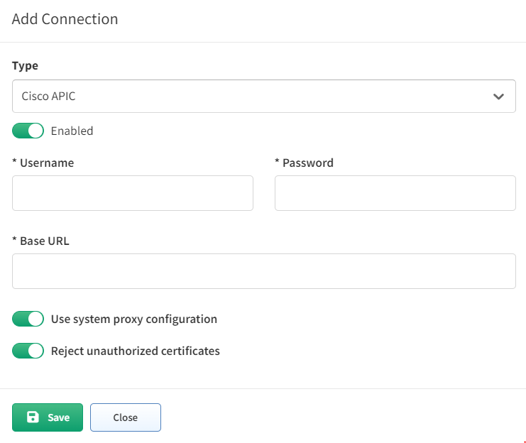

# Cisco APIC

Starting version 5.0 IP Fabric collects information from APIC controller and provides information about Tenants (including Contexts/VRFs, Applications, Endpoint groups and Contracts) and APIC cluster members.

Information about controller is collected via SSH.

Tenants, applications, contracts etc. data are collected via API.

To successfully collect data from Cisco APIC it is necessary to configure Cisco APIC in global Vendor API settings and to add Cisco APIC IP address to the discovery seed.

Go to **Settings → Discovery Seed** and add Cisco APIC IP address

Go to **Settings → Advanced → Vendors API** and press the **+Add** button

Afterward, choose Cisco APIC from the list and fill in

- **Username and password** used to log in to Cisco APIC

- **Base URL** of Cisco APIC e.g. `https://cisco-apic-ip-address`

## Know issues

[APIC Tables are all empty except Controllers](../../../releases/known_issues/cisco/apic_tables_empty.md)
