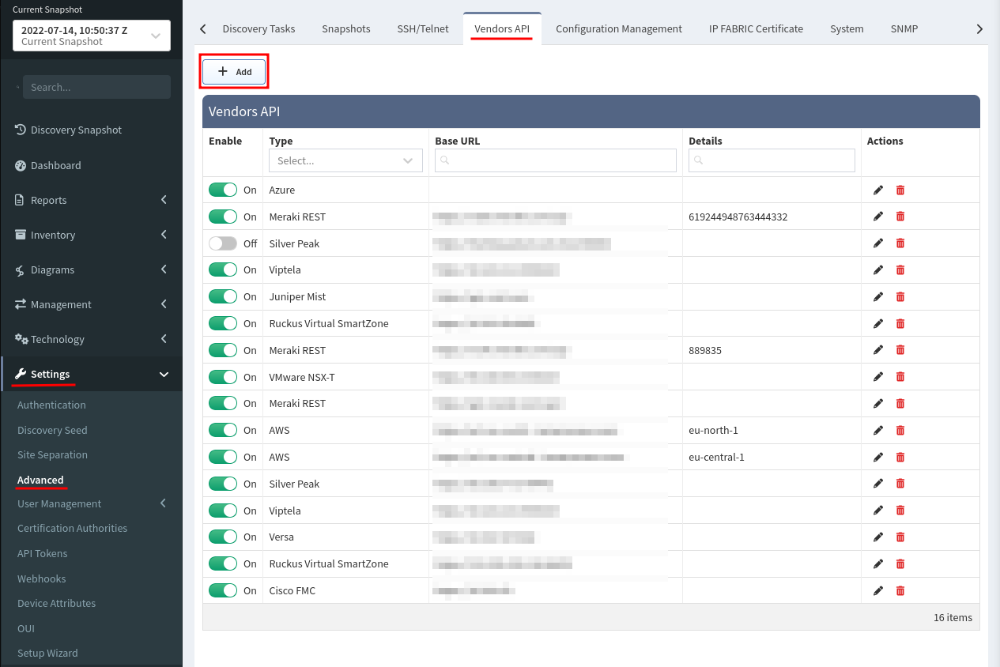
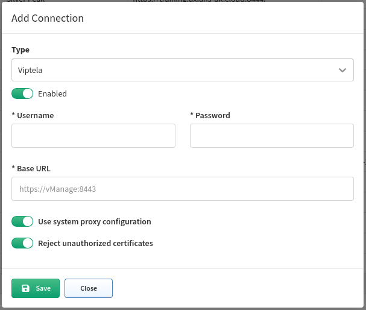

# Cisco Viptela

## Cisco Viptela SD-WAN

Starting version **4.1.0** IP Fabric supports Viptela API. Viptela devices are discovered only through API.

1. To add Viptela to discovery global settings, go to **Settings → Advanced → Vendors API** and press **the+Add** button

    

2. Afterward, choose Viptela API from the list and fill in

    

    - **Username and password** used to log in to vManage
    - **Base URL** of vManage server ([https://vmanage-ip-address](https://vmanage-ip-address))

## Cisco Viptela cEdge

Starting version **4.4.0** IP Fabric supports Viptela on Cisco IOS XE devices in the controller (SD-WAN) mode (cEdge). Thus from the version 4.4 cEdge devices are discoverable only through the vManage API.
