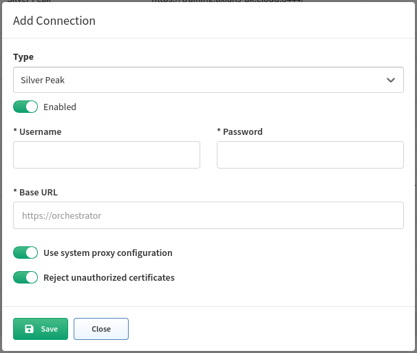

# Silver Peak SD-WAN

Starting version **4.3** IP Fabric supports the discovery of Silver Peak (Aruba) EdgeConnect devices in router mode.

EdgeConnect devices are discovered only through API.

To add EdgeConnect to discovery global settings, go to **Settings → Advanced → Vendors API** and press the **+Add** button

Afterward, choose Silver Peak from the list and fill in

-   **Username and password** to log in to Unity Orchestrator

!!! info
    if a user has just RO rights, ARP table will NOT be downloaded - this is not supported by the orchestrator’s API

-   **Base URL** of Unity Orchestrator (`https://unity-orchestrator-ip`)

