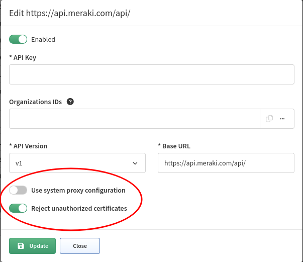

# Overview

IP Fabric supports discovery of network devices via a **dedicated Vendors' APIs**.

They are frequently **complementary to CLI** based discovery process for the established networking vendors, but **completely essential** for **SD-WAN** or **cloud vendors**.

This section describes per-API specific settings for supported APIs.

For each Vendor API, **additional system settings** can be applied.

## System Proxy

**System proxy** is by default used for communication from IP Fabric to the Internet e.g. IP Fabric and system updates.

Some Vendor API controllers might be **located on the Internet** or other parts of the network and sending traffic through the System proxy might be required.

This setting can be enabled/disabled per Vendor API.

## Reject Unauthorized Certificates

Due to **security reasons**, accepting unauthorized certificates might be undesired.

This setting can be enabled/disabled per Vendor API.

