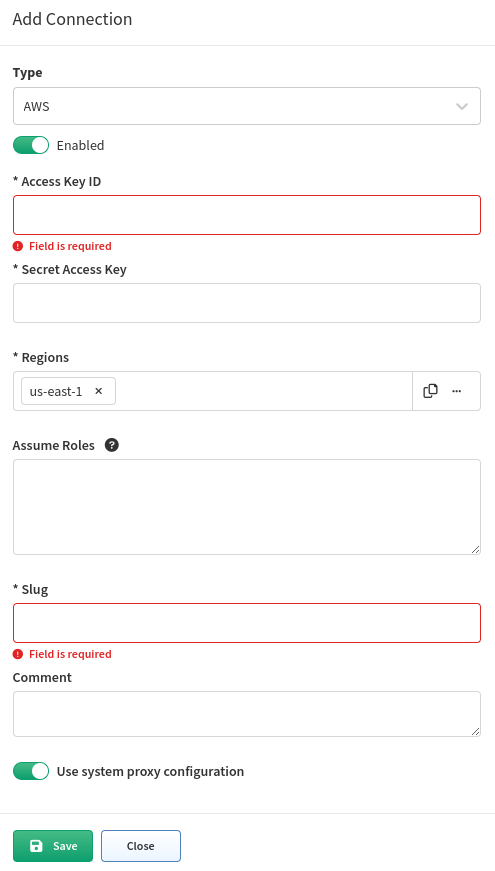

# Overview

IP Fabric supports discovery of network devices via a **dedicated Vendors' APIs**.

They are frequently **complementary to CLI** based discovery process for the established networking vendors, but **completely essential** for **SD-WAN** or **cloud vendors**.

This section describes per-API specific settings for supported APIs.

For each Vendor API, **additional system settings** can be applied.

## Slug and Comment

Every instance of vendor API configuration have two additional fields (example shows screenshot of AWS configuration)

`Slug`

: Slug has to be unique and not empty. It is included in logs and other places to distinguish among potentially multiple API instances (think about it as `loginIP` for API). We recommend using short and descriptive values, such as `aws-us`, `aws-jp` etc.

: !!! info "Slug?"

          Slug has many meanings, but in the computer world, it became a name for the unique identifying part of a web address, typically at the end of the URL. See [MDN](https://developer.mozilla.org/en-US/docs/Glossary/Slug) for more information.

`Comment`

: Optional free text field for you to capture additional information about the API instance.

## System Proxy

**System proxy** is by default used for communication from IP Fabric to the Internet e.g. IP Fabric and system updates.

Some Vendor API controllers might be **located on the Internet** or other parts of the network and sending traffic through the System proxy might be required.

This setting can be enabled/disabled per Vendor API.

## Reject Unauthorized Certificates

Due to **security reasons**, accepting unauthorized certificates might be undesired.

This setting can be enabled/disabled per Vendor API.

