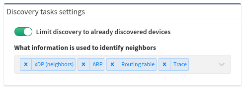

# Discovery Tasks Settings

The Discovery tasks feature was first introduced in **IP Fabric version
3.5.2** as a fast discovery enablement for large scale networks. When
enabled, it will use current ‘Discovery History’ database (in Management
\> Discovery History) only when creating a new snapshot **without
detecting any new network devices** during the discovery process.

If limit is disabled and discovery crawl through whole network is
performed, you can choose which options will be used for new devices
detection (ARP, CDP/LLDP, Routing Table records or a Traceroute).
Default is to use all available options.

The feature is especially helpful for large complex networks with
already defined device scope to avoid multiple repetitive failed
SSH/Telnet attempts that may slow down snapshot creation.

When "Limit discovery" is enabled it also ignores all new devices from
the discovery seed and new include lists! If you need to discover new
device(s) with "Limit discovery" please add them manually to the last
(or any other) snapshot.
