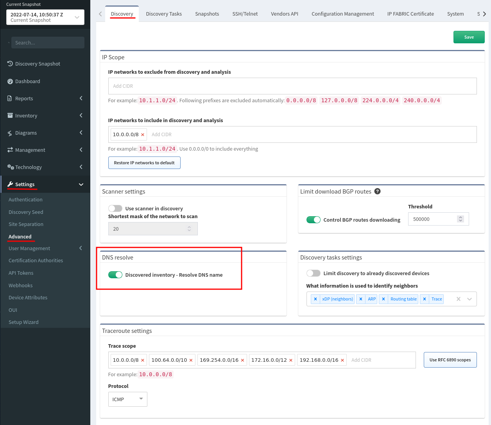
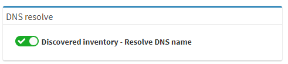

# DNS resolve

When this option is enabled, IP Fabric performs the IP address to a DNS
name translation. This feature creates many requests to configured DNS
servers during the Discovery process.

To enable this option go to **Settings → Advanced → Discovery → DNS
resolve** and click the on on/off switch.

