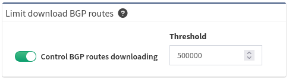

# Limit Download of BGP Routes

The full routing table, including full BGP, may contain fewer than 700K
records in 2020.

Downloading and processing such a large amount of data
is time-consuming and may not provide any relevant information about the
internal IP addressing scheme.  

In cases where we expect to discover a router with a full BGP table, we
can limit the total number of BGP routes stored in the database.

You can find the threshold configuration in the **Settings → Advanced →
Discovery tab**.

The lower limit available is currently 10000 BGP routes. The IP Fabric
will read the full routing table but will filter BGP routes per the
threshold before storing them in the database.

