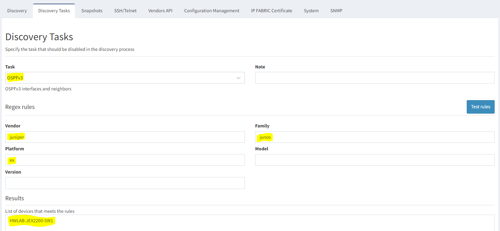

# Discovery Tasks

The discovery process for network device divides into multiple Tasks.
The TASK is a data collection related to a specific network protocol or
technology (MPLS, Transceivers, ARP Table, Spanning-Tree Protocol,
Multicast, or VXLAN). Each task consists of 1 or more operational
commands (CLI or API). You can find the list of all Discovery Tasks
in [the Feature matrix](https://matrix.ipfabric.io).

Some fundamental TASKS required for discovery and topology calculations
cannot be disabled (Neighbors, ARP, Mac, RIB, etc.)

The Discovery Tasks settings are introduced in version 3.7.0. Since
then, the user can manipulate specific tasks for the discovery process
to avoid extra data collection (when particular protocols are not
present on the network) or avoid specific operational commands to be
executed on specific hardware platforms.

By default, there are **three main Discovery Task rules** in the
platform:

| **Rule Name**          | **Rule Description**                                                                                                                                                                                                 |
| ---------------------- | -------------------------------------------------------------------------------------------------------------------------------------------------------------------------------------------------------------------- |
| **Disable Pagination** | By default disabled for F5 devices - command is modifying the configuration and can break cluster synchronization.                                                                                                   |
| **Transceivers**       | By default disabled for all vendors - certain Cisco platforms may be affected by a memory leak bug and lead to device crash or hung VTY line. More at [Known Issues \> Cisco](../../releases/known_issues/cisco/index.md) |
| **NTP**                | By default disabled for Cisco Firepower - on some versions a Firepower bug may freeze the CLI session                                                                                                                |

In the following example, we are creating a rule to disable OSPFv3 on
Juniper EX. The test for the rule reveals one match, the
HWLAB-JEX2200-SW1 switch:

