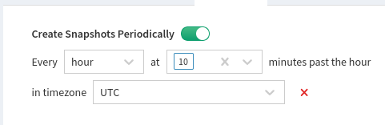

## Snapshots

For [change management](../../../IP_Fabric_GUI/management/changes/), regularly running IP Fabric
discovery is necessary. A periodic discovery run can be scheduled
at **Settings → Advanced → Snapshots → Timed Snapshots.**

Here is an example for an automatic discovery run at **10 minutes past
every hour** (0:10; 1:10; 2:10; 3:10, etc.).

### How Scheduling Work In IPF

Let's assume that snapshot is scheduled for every hour and snapshot
takes 4h:20min to be created, then the next snapshot will be scheduled
once the previous snapshot finishes. The scheduled time will be set at
the next possible period according to the cron setup.

##  Snapshot Retention Rules (from version 4.1)

We added support for various snapshot retention policies in IP Fabric
version 4.1.

### How Does the Snapshot Retention Work

It works in two steps:

1.  If any of the **keep** rules are enabled, IP Fabric goes through
    unloaded snapshots and based on enabled **keep** rules it marks
    snapshots that will retain and those that will be deleted.

2.  HDD utilization and a number of unloaded snapshots are checked. If
    any of these rules are exceeded, the oldest unloaded snapshots are
    deleted.

Please note:

1.  HDD utilization and the number of snapshots have precedence over
    **keep** rules. This means that snapshots marked as retained by a
    **keep** rule can be deleted when the HDD utilization or number of
    snapshots are exceeded.

2.  When at least one retention rule is enabled, all snapshots not
    protected by them will be removed regardless of reaching HDD
    utilization or snapshots count limits.

3.  Loaded snapshots are not affected by these rules. It affects only
    unloaded snapshots

4.  IP Fabric only supports delete action at the moment. Additional
    actions will be added in coming releases

!!! info
    At the moment, snapshot retention runs everyday at 0:00 UTC time
