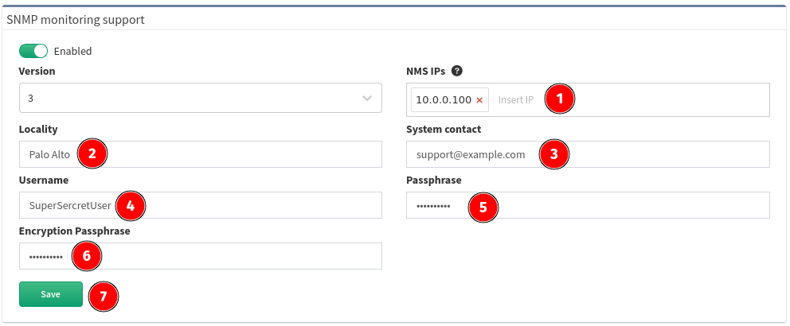

# SNMP

IP Fabric appliance can be monitored using SNMP protocol. CPU, memory,
hard drives and network interfaces can be monitored. Appliance uses
standard Linux OS OIDs.

To enable SNMP on IP Fabric appliance do following steps:

1. Login to IP Fabric web interface
2. Go to **Settings → Advanced → SNMP**
3. Click **disabled** button to enable it
4. Select **Version** (2c or 3 is supported)

    

!!! check Security note

    Only IP address specified in the **Host IP** field is enabled to have access to SNMP 161/udp.

If you selected **version 2c** please configure:

1. **Host IP** - IP address of remote monitoring server
2. **Locality** - location of IP Fabric appliance
3. **System Contact** - contact to responsible person or department
4. **Community string** - must match community string configured on monitoring server
5. Click **Save**

    

If you selected **version 3** please configure:

!!! info SNMP v3

    For user authentication only SHA is supported. For data privacy AES is used.

1. **Host IP** - IP address of remote monitoring server
2. **Locality** - location of IP Fabric appliance
3. **System Contact** - contact to responsible person or department
4. **Username** - SNMP v3 user
5. **Passphrase** - authentication and privacy passphrase

	!!! Info
		Passphrase can contain only the following characters `A-Za-z0-9.,/-_@%^:=+`

6. Click **Save**

    
