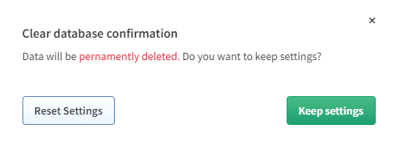

# Clear DB

!!! warning

    Before erasing databases, make sure that you have access to a recent backup!

In rare cases, it may be necessary to delete and recreate the IP
Fabric's database. Go to **Settings → Advanced → System** and click
**Clear DB**.

When running Clear DB, all loaded snapshots are automatically unloaded
and the database recreated.

There is two-way confirmation.

In the second screen, you can choose from Reset Settings or Keep Settings.

!!! info
    We recommend Keeping Settings.

Discovery settings data will be lost and the system setting will be
reset to defaults **except**:

- Certification authorities
- User settings
- LDAP settings
- Custom filters and colors
- Custom URL (custom view)
- Reports settings
- Dashboard settings

!!! warning
    New API tokens will have to be created after clearing the DB
