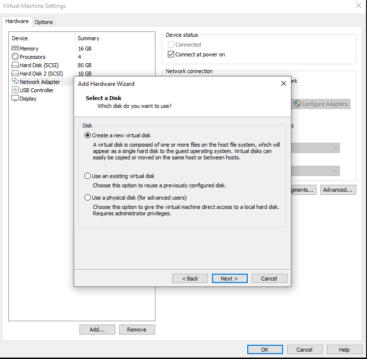
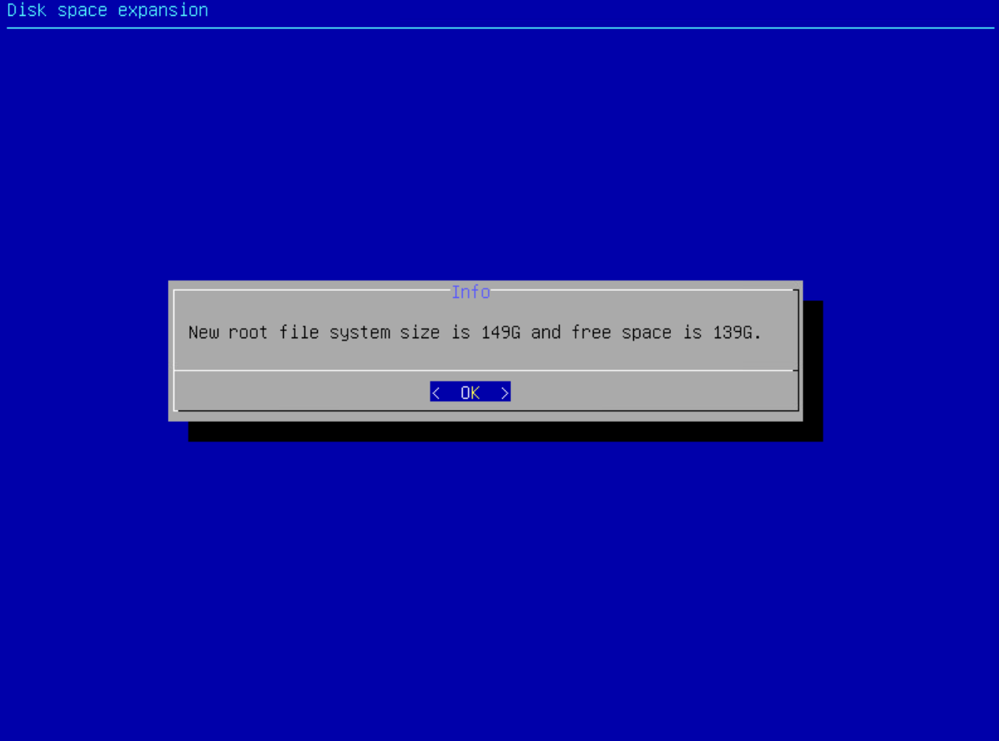

# Schedule System Backup

## Backup

Use IP Fabric backup to protect your important data.

There are two types of backup:

-   Local backup
-   Remote backup (FTP, sFTP)

!!! tip

    Backups are encrypted with `osadmin` user password configured during the *first boot wizard*. When you lose `osadmin` user password, backups are also lost!

## Local backup

Local backup saves database, user and system files locally on a dedicated backup volume. It's highly recommended placing backup volume on different datastore ideally on different physical storage.

!!! info "Backup Disk"

    The backup disk is not present by default! Please add a new virtual disk to enable local backups. (See below)

### Adding a new virtual disk to your IP Fabric VM as a local backup disk

1. Open your VM platform.
1. Go to IP Fabric VM settings and add *New Hard Disk*.
1. Select size of a new disk.
1. Specify the type of a new disk (for the backup volume it is recommended to select a virtual disk on a different datastore ideally on different physical storage).

    

1. Finish configuration wizard.
1. Launch Remote (Web) Console.
1. Reboot (*Send Ctrl+Alt+Delete* function can be also used) or power on IP Fabric VM.
1. During system boot, a *Disk space expansion* wizard appears.

    

1. Select *Yes* to start disk space expansion.
1. Expand the new volume as a backup (Backup is used only for local backups).
1. Selected volume is extended.

    

1. Hit *OK*

### Automatic Local Backups

To schedule automatic local backups do the following steps:

1.  Add dedicated backup volume if not available - see steps above.
1.  Login to the user interface.
1.  Go to *Settings → Advanced → System → Schedule system backup*.
1.  Change *Destination* to *Local hard drive*.
1.  Set a backup schedule. See example for "Every day at 3:00".
1.  Enable backup.

## Remote backup

Remote backup saves database, user and system files remotely using `FTP` or `sFTP`.

!!! note

    This is a recommended type of backup.

!!! warning

    A directory **has to be specified** for FTP and SFTP backups

To set up remote backup do the following steps:

1.  Login to the user interface.
1.  Go to *Settings → Advanced → System → Schedule system backup*.
1.  Enable backup.
1.  Set a backup schedule. See example for "Every day at 5:15 and 17:15 (for setting more options, please, hold SHIFT during selection)".  
    
1.  Change *Destination* to `FTP` or `SFTP`.
1.  Enter remote FTP/SFTP *Server* FQDN or IP address. Make sure that your DNS client is configured and working properly in case of FQDN.
1.  Enter *Username* to access FTP/SFTP server.
1.  Enter *Password* to access FTP/SFTP server.
1.  Specify a *Directory* where FTP/SFTP backup should be uploaded.
1.  Click *Save*.
1.  IP Fabric tries to reach FTP/SFTP server with configured parameters.

!!! warning

    FTP/SFTP user needs read, write, list and delete permissions.

!!! note

    From version 4.1.1 onward we do not check validity of SSL certificates during FTP backups.

## Trigger a backup manually (on-demand)

Both types of backup can be also triggered manually on demand. This is useful for example before a system upgrade.

Manual backup can be triggered from IP Fabric Administrative interface:

1.  Login to admin interface (for example `https://ipfabric.example.com:8443`
1.  Go to *Restore or Backup*
1.  Select *Backup* from *Do you wish to proceed with a backup or restore?* drop-down menu.
1.  For local backup select *Local hard drive* from the *Backup files destination*.
1.  For remote backup select `FTP` or `SFTP` from the *Backup files destination*.
    1.  Enter remote FTP/SFTP *Server* FQDN or IP address. Make sure that your DNS client is configured and working properly in the case of FQDN.
    1.  Enter *Username* to access FTP/SFTP server.
    1.  Enter *Password* to access FTP/SFTP server.
    1.  Specify a *Directory* where FTP/SFTP backup should be uploaded.
1.  Click *Next*
