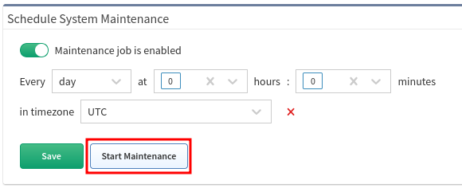

# Schedule System Maintenance

To ensure the platform’s good health, it’s highly recommended to run the
System Maintenance on regular basis. The recommended frequency for
System Maintenance is once a day.

Even though the process is very quick, we would recommend performing it
at a time when no one is working with the platform, as access is not
available during the maintenance.

Sometimes it is necessary to run maintenance manually, this can be done
in this menu with the Start Maintenance button.

