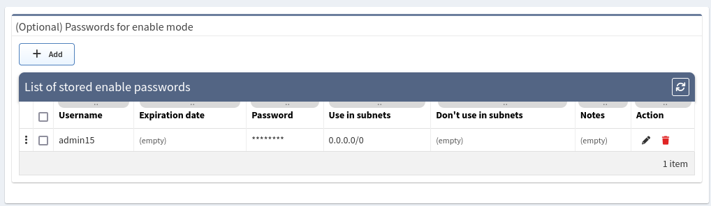

# Authentication

IP Fabric interacts with the network infrastructure devices by running show
commands through CLI using SSH or Telnet. Credentials added in the
Authentication section will be used by IP Fabric to access the CLI of the
network devices.

## Credential Selection Logic

If more credentials are specified, a top-down algorithm is used when trying to
login to a network device or the credentials priority can be changed using drag
and drop.

## Configure Network Infrastructure Access

Read-only (Privilege 1) credentials are sufficient for basic functionality.
Security sensitive operations and advanced functionality might require higher
privilege. See the
[full list of used command in the documentation](https://matrix.ipfabric.io/).

When adding new credentials, you can limit the validity of the credentials just
for a part of your network using **Use in subnets**
and **Don't use in subnets** fields.

Provided credentials can be used for configuration change tracking and saved
configuration consistency (i.e. they allow commands such as **show run** and 
**show start**).

To use this credentials for configuration change tracking, please
check [Use for configuration management](advanced/configuration_management.md)
box.

## (Optional) Passwords for Enable Mode

Privileged credentials are generally only necessary for configuration
management. However, some platforms require privileged credentials to access
basic network state information, such as MST spanning-tree state or 802.1X
session information.

