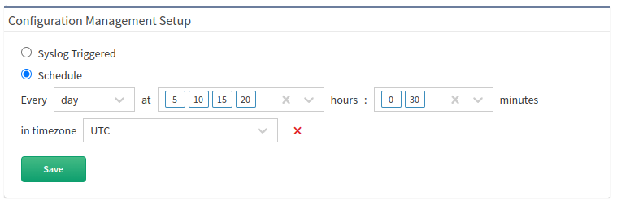

# Configuration Management

There are two ways to detect configuration changes:

- **Syslog Triggered**
- **Scheduled**

## Syslog Triggered

IP Fabric checks incoming syslog messages for key phrases (for example, `Configured from console by admin15 on vty0.`). This option needs the appropriate `syslog` configuration on the device side.

The syslog server listens on port `514/udp`, and there is no additional configuration on the IP Fabric side needed. You can send syslog directly from network devices ([example for Cisco IOS](https://community.cisco.com/t5/network-architecture-documents/how-to-configure-logging-in-cisco-ios/tac-p/3132436))
or use a syslog forwarder ([example for syslog-ng](https://support.symantec.com/en_US/article.TECH92854.html)).

Please note:

- The receiving port `514` cannot be modified.
- The syslog messages are filtered and are stored in RabbitMQ apart from the main DB and cannot be observed in IP Fabric's GUI.

To enable the syslog triggered configuration management, go to **Settings --> Configuration Management --> Configuration Management Setup** and select **Syslog Triggered**.

## Schedule

Configuration change is checked at regular intervals as configured by user.

To enable the scheduled configuration management, go to **Settings --> Configuration Management --> Configuration Management Setup** and select **Schedule**.

!!! example

    Example for scheduling a check every day at 5:00; 5:30; 10:00; 10:30; 15:00; 15:30; 20:00; 20:30.

    

Multiple values from the lists can be selected while holding the `Ctrl` or `Shift` keys.

## API Trigger

Config collection can be triggered for a single device via an API call based on an IP Address or IP Fabric Unique 
Serial Number (`sn`).  For complete instructions please see 
[Trigger Manual Configuration Backup](../IP_Fabric_API/manual_config_backup.md).
