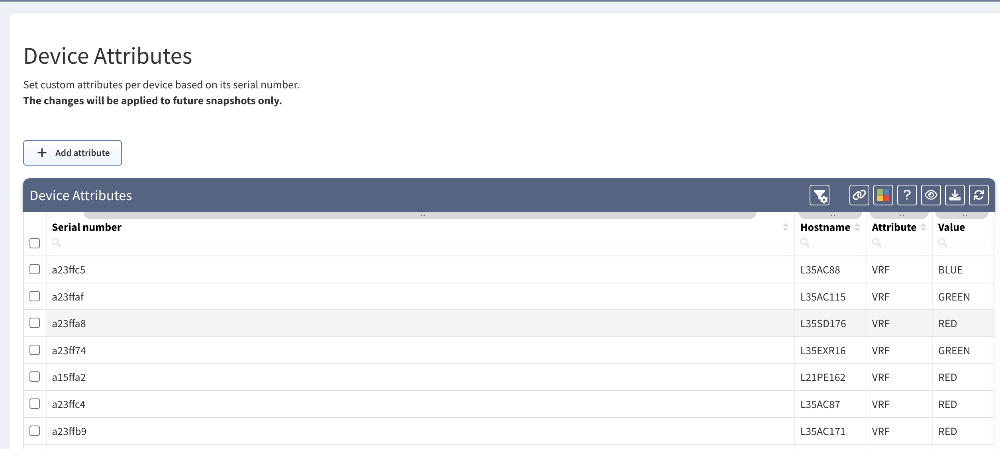
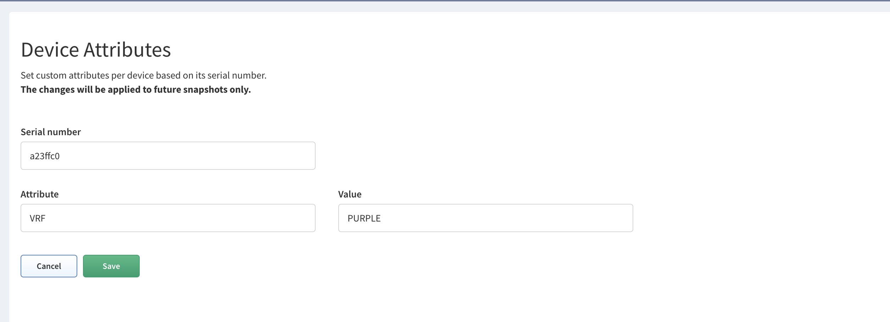

# Device Attributes

Version 4.3.X has added the ability to add attributes to a device based
on the IP Fabric Unique Serial Number. Currently this supports manually
changing a Device’s Site Name, Routing Domain, or STP Domain. More
functionality will be released in future versions. Once an attribute is
assigned a new snapshot is required for it to be applied.

- **Serial Number** is IP Fabric’s **Unique Serial Number** (API column
  `sn`); this is not the column **Serial Number** which represents the
  Hardware SN (API column `snHw`)

  - Devices discovered via API can also be assigned using Device
    Attributes.

- **Hostname** is populated by IP Fabric when a device matching the
  **Serial Number** is found

- **Attribute** is the Device Attribute to assign. Currently supported
  is Site Name, Routing Domain, or STP Domain

- **Value** is the attribute’s value to assign.

## Creating rules in the UI

You can create rules in the UI by selecting the **Add
attribute** button. This will provide you a form to fill out.

The dropdown is intuitive and will let you search based on SN or
hostname.

!!! Info

    Currently, there is an issue where IP Fabric will not search
    for devices discovered via an API in the UI. Even though it seems that no
    device matches the SN, the attribute will still be assigned to the device.

## Creating rules via the API

This is the preferred method of creating rules as it allows for bulk
importing.

| Method | Put                                                                                          |
| :----- | :------------------------------------------------------------------------------------------- |
| URL    | `https://<IPF_URL>/api/v5.0/attributes/global`                                                 |
| Data   | `{"attributes": [{"sn": "<IPF SERIAL NUMBER>", "value": "<SITE NAME>", "name": "siteName"}]}`|

## Creating Rules With `python-ipfabric` Package

Please see example at the following GitHub location:

<https://github.com/community-fabric/python-ipfabric/blob/develop/examples/settings/attributes.py>

