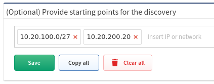

# Discovery Seed

If you know a particular starting point for discovering the network, the
information can be entered at **Settings → Discovery Seed**. This option
does not exclude any networks from discovery.

The starting points can be management IP addresses of network devices or
network subnets. Existing inventory data can also be imported.

If no seed information is entered, the discovery will begin from the
current default gateway.

!!! note
    It is recommended to provide multiple IP addresses of core routers as a
    starting point for discovery.
