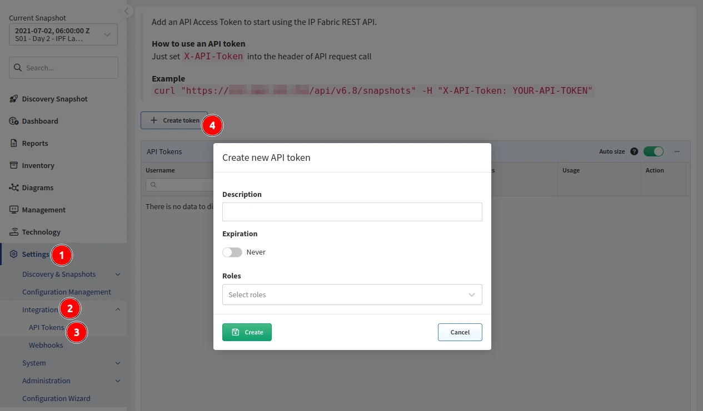

# API Tokens

Until version `3.7.0`, the only available means of authenticating the API calls
from outside were either:

- Username and password (to be able to login).
- Or short-lived UI tokens generated by the API, sent as JWT along the requests.
  There is also a refresh token used to renew the short-lived UI tokens.

The information about the user, along with the user's permissions, is encoded
in the token itself. So once the UI token is issued, it cannot be revoked
(that's why the tokens are typically short-lived).

Starting from version `3.7.0`, long-lived API tokens were introduced for
authenticating API calls. They are a bit slower than UI tokens, as the token is
verified in the database with each API call, but they can be revoked easily.

## Generate API Token

To use API tokens, you need to generate them in the UI (in **Settings -->
Integration --> API Tokens**) or using the API.



Please note that the token string is only visible when you create the token in
the UI or in the returned API JSON response. For this reason, please make sure
that you copy the token string when creating the API token in the UI.

Starting from version `6.3.0`, the API token must be auto-generated by IP Fabric
and cannot be a custom string. This is a breaking change when posting to
`/api/v6.3/api-tokens`, which no longer accepts the `token` argument when
creating a new token using the API.

## Use API Token

To use the token, send it in the `X-API-Token` HTTP header along with an
request:

```bash
curl -v -H "X-API-Token: ${YOUR_TOKEN}" https://${IPF_HOST_PORT}/api/v5.0/api-tokens
```
