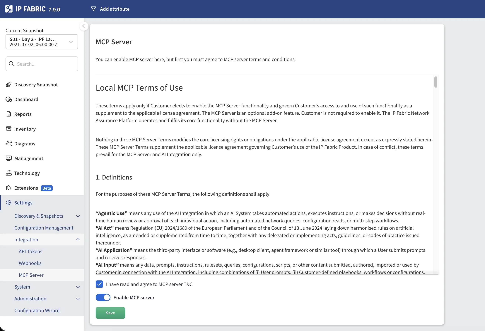

# IP Fabric MCP Server

## Overview

The IP Fabric MCP Server is a [Model Context Protocol (MCP)](https://modelcontextprotocol.io/) server that
provides AI assistants with access to your IP Fabric network data. Key capabilities include:

- **Query network health** using natural language
- **Analyze connectivity paths** between endpoints with visual diagrams
- **Explore device inventory** and configurations
- **Troubleshoot routing issues** (BGP, OSPF, and more)
- **Validate network intents** and compliance

The server exposes IP Fabric's capabilities through standardized MCP tools, prompts, and resources that AI
assistants can use to answer your network-related questions.

## Prerequisites

- HTTPS access to an instance of **IP Fabric**
- **[API Token](api_tokens.md)** from your IP Fabric instance with
  appropriate permissions
- **MCP Server Terms & Conditions** accepted and the server enabled in the IP Fabric UI (see
  [Step 1](#step-1-enable-the-mcp-server-in-ip-fabric) below)
- An AI assistant that supports MCP — tested with **Claude Desktop** and
  **VS Code with GitHub Copilot**

## Security Considerations

- **API Token:** Your IP Fabric API token is used to authenticate AI assistant requests. The MCP server
  has no implicit access to IP Fabric data — every request is authorized solely through the provided
  API token. Generate a dedicated token with the minimum required permissions and rotate it regularly.
- **Network Access:** The MCP server runs on the IP Fabric appliance and is accessed over HTTPS. Ensure
  appropriate network segmentation and firewall rules are in place between your AI client and the
  appliance.

## Step 1 — Enable the MCP Server in IP Fabric

The MCP server is built into the IP Fabric appliance and can be enabled directly from the web UI.

1. Log in to your IP Fabric instance.
2. Navigate to **Settings --> Integration --> MCP Server**.
3. Read the **Local MCP Terms of Use** and check **I have read and agree to MCP server T&C**.
4. Toggle **Enable MCP server** to on.
5. Click **Save**.



Once enabled, the MCP server endpoint is available at
`https://<your-ipfabric-host>/mcp`.

## Step 2 — Generate an API Token

The MCP server authenticates to IP Fabric using an API token. The token's
[Role-Based Access Control (RBAC)](api_tokens.md)
scope is fully respected — the MCP server (and therefore the AI assistant) can
only access the data and actions permitted by the role assigned to the token.

Multiple AI clients can connect to the same MCP server simultaneously, each
using its own API token. Every token is evaluated independently, so different
users or teams can have separate access levels through the same MCP endpoint.

When creating the token, select a role with the minimum permissions required for
your use case. For instructions on creating an API token, see
[API Tokens](api_tokens.md). For details on
how the token is used for authentication, see
[Authentication — API Token](../../IP_Fabric_API/authentication.md#api-token).

## Step 3 — Connect to an AI Assistant

### Claude Desktop

At the time of writing, Claude Desktop only supports local (stdio) MCP servers.
A local proxy is therefore needed to connect to the remote IP Fabric MCP server.
This requires [Node.js LTS](https://nodejs.org/) to be installed on your machine.

**1. Locate your Claude Desktop configuration:**

Select your user profile, then **Settings**, then **Developer**. Clicking **Edit**
will open `claude_desktop_config.json`.

**2. Add the MCP server configuration:**

```json
{
  "mcpServers": {
    "ipfabric-mcp": {
      "command": "npx",
      "args": [
        "-y",
        "mcp-remote",
        "https://<your-ipfabric-host>/mcp",
        "--header",
        "Authorization:${AUTH_HEADER}"
      ],
      "env": {
        "AUTH_HEADER": "Bearer <YOUR_API_TOKEN_HERE>"
      }
    }
  }
}
```

!!! note

    We use the `npx` command to download and start a proxy called `mcp-remote` in Node.

    - `npx` looks up an npm package and runs its executable, downloading it on the fly.
    - `-y` auto-confirms the install prompt.
    - `mcp-remote` is the name of the npm package being executed.
    - `--header` passes the `Authorization` header on every request to the MCP server.
    - The token value is kept in `env` to avoid exposing it directly in the args.
      Use the format `Bearer <token>`.

    The `-y` flag in the args above is required on macOS to skip the interactive
    install prompt. If the command fails, try replacing `npx` with the full path
    to the `npx` shell script (e.g., `/usr/local/bin/npx`).

**3. Restart Claude Desktop** to apply the configuration.

**4. Verify the connection:** Look for the MCP tools icon in Claude's interface.

### VS Code with GitHub Copilot

**1. Locate your VS Code MCP configuration:**

- macOS: `~/Library/Application Support/Code/User/mcp.json`
- Linux: `~/.config/Code/User/mcp.json`
- Windows: `%APPDATA%\Code\User\mcp.json`

**2. Add the server configuration:**

```json
{
  "servers": {
    "ipfabric-mcp": {
      "url": "https://<your-ipfabric-host>/mcp",
      "type": "http",
      "headers": {
        "Authorization": "Bearer <YOUR_API_TOKEN_HERE>"
      }
    }
  }
}
```

**3. Start the MCP server from VS Code:**

- Open Command Palette: `⌘+Shift+P` (macOS) or `Ctrl+Shift+P` (Windows/Linux)
- Run: `MCP: List Servers`
- Select: `ipfabric-mcp` → `Start Server`

**4. Verify** in the Output panel (**View → Output**) that tools are loaded successfully.

!!! note

    If you encounter JSON validation errors, disable JSON validation in VS Code settings: search for
    **JSON > Validate: Enable** and uncheck it.

## Step 4 — Use the MCP Server

### Available Tools

The MCP server provides specialized tools for network analysis. Your AI assistant automatically
selects the appropriate tool based on your prompt.

#### Network Health Assessment

**Tool:** `ipf_network_health_assess`

Provides a comprehensive overview of your network health including:

- **Snapshot freshness** — How recent is the network discovery data
- **Intent verification** — Built-in and custom intent rule results
- **Inventory issues** — Device health, uptime, licensing
- **Routing stability** — BGP/OSPF neighbor states
- **Path check results** — End-to-end connectivity validation

Example prompts:

```
Check network health
Show me critical issues only
What's the BGP status across my network?
Are there any routing problems?
```

#### Path Lookup Tools

##### Unicast Path Lookup

**Tool:** `ipf_pathlookup_unicast`

Traces the path between two IP addresses and returns structured path data.

Example prompts:

```
Show me the path from 10.0.1.5 to 10.0.2.10
Why can't 192.168.1.100 reach 172.16.0.50?
```

Parameters:

| Parameter            | Required | Description                                                              |
|----------------------|----------|--------------------------------------------------------------------------|
| `src`                | Yes      | Source IP address                                                        |
| `dst`                | Yes      | Destination IP address                                                   |
| `snapshotId`         | Yes      | UUID of the snapshot to analyze                                          |
| `groupBy`            | Yes      | Grouping method: `siteName`, `routingDomain`, or `stpDomain`             |
| `protocol`           | No       | Protocol: `icmp` (default), `tcp`, or `udp`                              |
| `l4Options`          | No       | Layer 4 options (ports, flags)                                           |
| `vrf`                | No       | VRF name if applicable                                                   |
| `includeGraphLayout` | No       | Include graph layout data in the response. By default, layout data is stripped from the result; set to `true` to include it explicitly. Default: `false` |

##### Host-to-Gateway Path Lookup

**Tool:** `ipf_pathlookup_host-to-gateway`

Traces the path from a host to its default gateway and returns structured path data.

Example prompts:

```
Show path from 192.168.1.100 to its gateway
How does host 10.0.5.25 reach its gateway?
```

Parameters:

| Parameter            | Required | Description                                                              |
|----------------------|----------|--------------------------------------------------------------------------|
| `src`                | Yes      | Source IP address                                                        |
| `snapshotId`         | Yes      | UUID of the snapshot to analyze                                          |
| `groupBy`            | Yes      | Grouping method: `siteName`, `routingDomain`, or `stpDomain`             |
| `vrf`                | No       | VRF name if applicable                                                   |
| `includeGraphLayout` | No       | Include graph layout data in the response. By default, layout data is stripped from the result; set to `true` to include it explicitly. Default: `false` |

##### Multicast Path Lookup

**Tool:** `ipf_pathlookup_multicast`

Traces multicast traffic paths from source to receivers and returns structured path data.

Example prompts:

```
Show multicast path for group 239.1.1.1 from source 10.0.1.5
Analyze multicast distribution for 239.255.0.1
```

Parameters:

| Parameter            | Required | Description                                                              |
|----------------------|----------|--------------------------------------------------------------------------|
| `src`                | Yes      | Source IP address                                                        |
| `group`              | Yes      | Multicast group address                                                  |
| `receiver`           | Yes      | Comma-separated receiver IP addresses                                    |
| `snapshotId`         | Yes      | UUID of the snapshot to analyze                                          |
| `groupBy`            | Yes      | Grouping method                                                          |
| `includeGraphLayout` | No       | Include graph layout data in the response. By default, layout data is stripped from the result; set to `true` to include it explicitly. Default: `false` |

#### Path Diagram Tools

Each path lookup tool has a companion that returns a **PNG diagram** of the path instead of structured data.

| Diagram Tool                         | Corresponding Path Lookup            |
|--------------------------------------|--------------------------------------|
| `ipf_png_pathlookup_unicast`         | `ipf_pathlookup_unicast`             |
| `ipf_png_pathlookup_host-to-gateway` | `ipf_pathlookup_host-to-gateway`     |
| `ipf_png_pathlookup_multicast`       | `ipf_pathlookup_multicast`           |

The diagram tools accept the same parameters as their corresponding path lookup tools (excluding
`includeGraphLayout`) and return a visual network path image.

Example prompts:

```
Trace route from server A to server B with diagram
Show multicast path for group 239.1.1.1 from source 10.0.1.5 with diagram
```

#### API Discovery Tools

For advanced queries not covered by specialized tools, use the API discovery workflow.

##### API Endpoint Search

**Tool:** `ipf_api_endpoint_search`

Finds relevant API endpoints using natural language.

Example prompts:

```
Find endpoints for device inventory
Search for BGP neighbor API
```

##### API Endpoint Details

**Tool:** `ipf_api_endpoint_details`

Gets detailed information about a specific endpoint including parameters and response schema.

##### API Invoke

**Tool:** `api_invoke`

Executes an API call with the specified parameters.

Example workflow:

1. Search: `"device inventory endpoints"`
2. Get details for the relevant endpoint
3. Invoke the endpoint with appropriate filters

### Available Prompts

Prompts provide structured templates for complex analysis tasks.

#### Path Analysis Prompt

**Name:** `path_analysis`

A guided prompt for detailed path analysis between network points.

How to use:

- **Claude Desktop** — Type `/` in the chat and select `path_analysis`.
- **VS Code with GitHub Copilot** — Type `@ipfabric-mcp` in the chat to invoke the MCP server, then describe the path analysis you need.

Parameters:
    - `snapshot` — Snapshot name to analyze
    - `source` — Source IP or device name
    - `destination` — Destination IP (for unicast)
    - `group` — Multicast group (if applicable)
    - `protocol` — TCP, UDP, or ICMP (optional)

This prompt generates a comprehensive analysis including hop-by-hop breakdown, issue identification, and
topology improvement recommendations.

### Available Playbooks (Resources)

Playbooks are reference guides provided by the MCP server that help the AI assistant make better
decisions. They contain domain-specific knowledge about network troubleshooting workflows and best
practices. How playbooks are selected or attached depends on the AI client you are using — in Claude
Desktop, they appear as resources in the MCP tools panel; in VS Code, they are available as context
for the AI assistant.

## Usage Examples

### Health Monitoring

Basic health check:

```
Check network health
```

Focus on specific areas:

```
Show me BGP issues only
Check routing protocol status with critical issues only
```

Investigate specific problems:

```
Are there any devices with high CPU utilization?
```

### Path Analysis

Basic connectivity:

```
Show the path from 10.0.1.5 to 10.0.2.10 with diagram
```

With protocol specification:

```
Trace the path from 192.168.1.10 to 172.16.0.5 using TCP port 443
```

Host to gateway:

```
Show how 192.168.1.100 reaches its default gateway
```

VRF-aware path:

```
Show path from 10.1.1.1 to 10.2.2.2 in VRF MGMT
```

Multicast:

```
Show multicast path for group 239.1.1.1 from source 10.0.1.5 with diagram
```

### Device Queries

Site-based inventory:

```
Show all Cisco devices in site HQ
```

Status queries:

```
Find devices with uptime less than 1 day
List devices with telnet enabled
```

### Protocol Analysis

BGP:

```
Show BGP neighbors that are not in Established state
```

OSPF:

```
List OSPF neighbors not in Full state
```

General routing:

```
Are there any routing adjacency issues?
```

## Troubleshooting

### Connection Issues

**Cannot reach the MCP server:**

1. Verify the MCP server is enabled in **Settings --> Integration --> MCP Server**.
2. Ensure the API token is valid and has not been revoked.

### API Errors

**401 Unauthorized:**

- Verify your API token is correct.
- Check that the token has not been revoked.
- Ensure the token has sufficient permissions.

**404 Not Found:**

- Verify the MCP server is enabled and that the URL is correct.

### Snapshot Errors

**"Snapshot not found":**

- Ensure snapshots are loaded in IP Fabric.
- The AI will automatically list available snapshots if needed.
- You can specify `$last` to use the most recent snapshot.

## Common Questions

**How do I disable the MCP server?**

Navigate to **Settings --> Integration --> MCP Server**, toggle **Enable MCP server** to off, and click
**Save**.

**Can I use a different API token for MCP?**

Yes. Generate a dedicated token under **Settings --> Integration --> API Tokens** with the minimum
required permissions and configure your AI client to use it.
